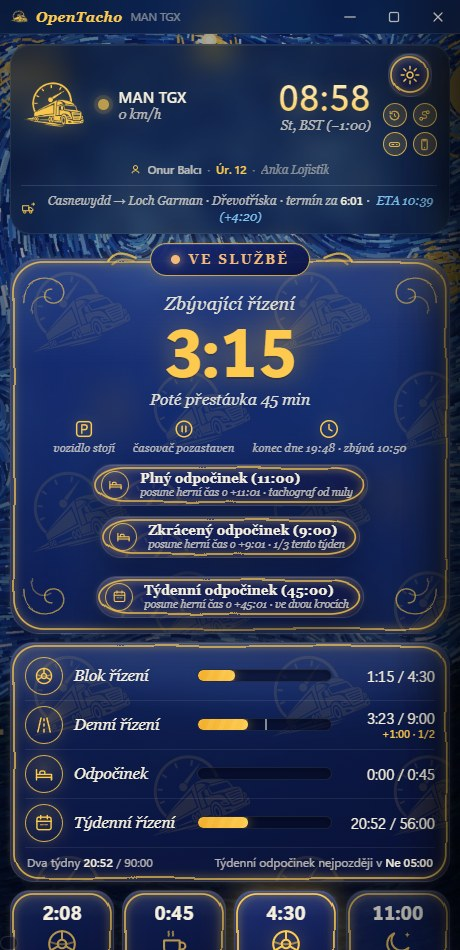
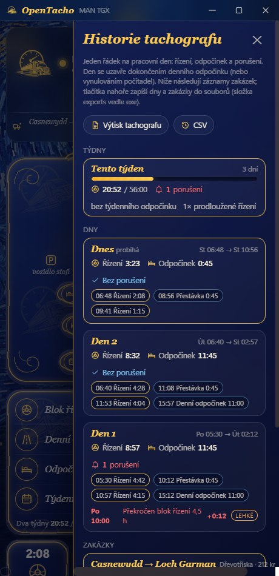
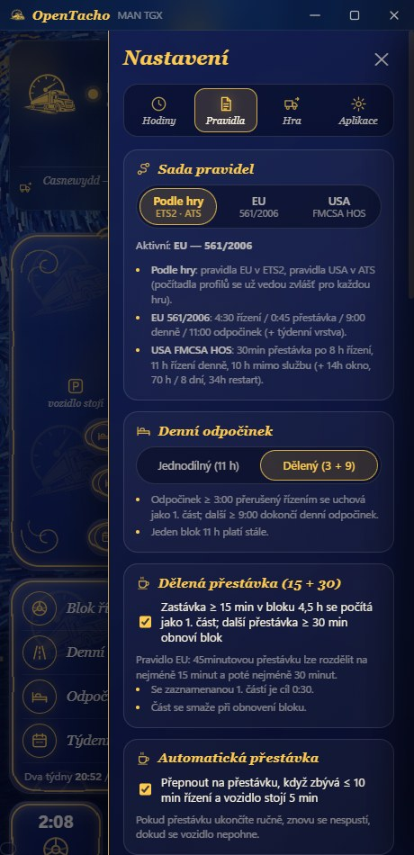
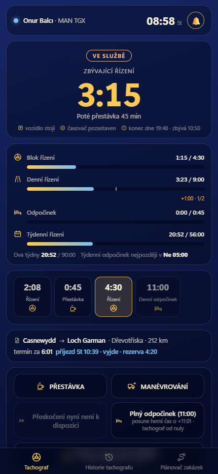

# OpenTacho

[English](README.md) · [Türkçe](README.tr.md) · [Deutsch](README.de.md) · [Русский](README.ru.md) · [Polski](README.pl.md) · [Português (Brasil)](README.pt-BR.md) · [Español](README.es.md) · [Français](README.fr.md) · [Italiano](README.it.md) · **Čeština**

Malý, přímočarý tachograf pracovní doby pro **Euro Truck Simulator 2** a
**American Truck Simulator** — jedno pravidlo, žádné složitosti, měřeno výhradně v **herním čase**:

> **4:30 řízení → 0:45 přestávka → 4:30 řízení → 11:00 denní odpočinek** (nebo dělený **3:00 + 9:00**)

Čte herní hodiny, rychlost, kamion a údaje o zakázce přímo ze hry, ukazuje, kolik vám zbývá,
a řeší nepříjemné případy (trajekty, spánek, časová pásma, načtené uložené hry, nakládku návěsu), abyste mohli jen řídit.

**Pouze Windows 10/11** — telemetrický plugin sdílí data přes sdílenou paměť Windows a aplikace používá API Windows pro klávesovou zkratku, zvuky a konzolový příkaz. Linux (nativní ETS2 / Proton) a macOS nejsou podporovány.

<p align="center">
  
  
  
</p>
<p align="center">
  
</p>
<p align="center">
  
</p>

## Rychlý start

1. Stáhněte **[OpenTacho-win64.zip](https://github.com/onurbalcii/OpenTacho/releases/latest/download/OpenTacho-win64.zip)**
   (všechny verze: [Releases](https://github.com/onurbalcii/OpenTacho/releases)) a rozbalte kamkoli.
2. Zkopírujte **`plugin\scs-telemetry.dll`** do složky pluginů hry
   (`…\Euro Truck Simulator 2\bin\win_x64\plugins\` — složku `plugins` vytvořte, pokud neexistuje;
   stejně pro ATS). Spusťte hru jednou a potvrďte výzvu SDK.
3. Spusťte **`OpenTacho.exe`**. To je vše — ostatní je součástí balíčku. Při prvním spuštění se zeptá
   na jazyk a nabídne krátkou prohlídku.

Pro tlačítko ⏩ Přeskočit zapněte ve hře vývojářskou konzoli: v
`Documents\Euro Truck Simulator 2\config.cfg` nastavte `g_console "1"` a `g_developer "1"`.
Tlačítko zůstává zamčené, dokud nejsou obě hodnoty zapnuté.

Pokud se okno vůbec neotevře, nainstalujte bezplatný
[WebView2 Runtime](https://developer.microsoft.com/microsoft-edge/webview2/) od Microsoftu — je už součástí
Windows 11 i každého aktualizovaného Windows 10, takže to bývá potřeba jen zřídka.

## Doporučené nastavení — důležité

Abyste z OpenTacho vytěžili maximum, vyřaďte vlastní mechaniku únavy ve hře a odpočinky přeskakujte
z aplikace:

1. **Vypněte simulaci únavy ve hře** — ETS2/ATS: *Možnosti → Hratelnost → Simulace únavy*
   (odškrtněte). Herní hodiny únavy nemají s pravidlem EU nic společného: zapnuté vás mohou donutit spát,
   i když tachograf ještě ukazuje zbývající řízení — nebo vás nechají jet dál, když tachograf říká stop.
2. **Nepoužívejte spánek ve hře** (odpočívadla, akce „spát“ v hotelu). Jsou to obecné časové skoky, které
   aplikace musí interpretovat: 30 s je zadržuje, aby odlišila nakládku od odpočinku, a o délce spánku rozhoduje
   hra — zřídka to je 11 h, které denní odpočinek vyžaduje, takže odpočinek zůstane nedokončený.
3. **Přeskakujte přestávky a odpočinky z aplikace** — když doba řízení vyprší, zastavte kamion a stiskněte
   ⏩ **Přeskočit** (45min přestávka / 11h odpočinek) nebo **Plný odpočinek**. Aplikace posune herní hodiny přesně o
   potřebnou dobu pomocí `g_set_time` a ihned ji na minutu přesně započte. Vyžaduje to
   herní konzoli (`config.cfg`: `g_console "1"`, `g_developer "1"`).

Výsledek: jedna konzistentní časová osa — doba řízení, přestávky, denní odpočinky i historie tachografu
odpovídají tomu, co jste skutečně udělali.

## Funkce

- **Živě ze hry** – hodiny, rychlost, model kamionu, aktivní zakázka (trasa, náklad, čas do doručení).
- **Řízení / ve službě rozpoznávané podle rychlosti**; **Přestávka** a **Manévrování** jsou tlačítka na jedno klepnutí.
- **Automatická přestávka**, když doba řízení téměř vypršela a kamion chvíli stojí.
- **Dělená přestávka (15 + 30)**: zastávka ≥ 15 min v bloku 4,5 h se uchová jako 1. část; pozdější
  přestávka ≥ 30 min obnoví blok (pravidlo EU). Lze vypnout.
- **Dělený denní odpočinek (3 + 9)** s pásem průběhu dne, který ukazuje každý dokončený blok, aktuální
  i plán; jednodílný odpočinek 11 h funguje dál. Lze uzamknout na jednodílný.
- **Plánovač zakázek**: zadejte vzdálenost a termín doručení z nabídky — aplikace nasimuluje přestávky a denní/týdenní odpočinky s
  vašimi aktuálními nároky a dá celkový čas, příjezd a rezervu (**vyjde / nevyjde**); s přijatou zakázkou přijde čas trasy
  a okno doručení ze hry a výsledek se živě zobrazí v řádku zakázky. Průměrná rychlost se učí z tachometru; přeprava **trajektem/vlakem**
  na trase se odhadne z času trasy (počítá se jako odpočinek) a lze ji zadat i ručně.
- **Herní profil**: aktivní profil je rozpoznán (jméno · úroveň · firma v horní kartě); počítadla, historie a události se
  vedou **pro každý profil** — přepněte profil ve hře a aplikace přepne počítadla (složka `profiles\`).
- **Přísný režim** (volitelně): přestávky a odpočinky se počítají jen s **vypnutým motorem + zataženou parkovací brzdou**; hlavní panel ukazuje, proč se nic nepočítá.
- **Závažnost porušení**: každé porušení je označeno podle tříd EU (lehké / vážné / velmi vážné); volitelné **virtuální pokuty** (€, přibližně); tlačítko **Zaplatit** je promítne do hry — kopie vaší nejnovější uložené hry s pokutou odečtenou z bankovního účtu se zapíše do nového slotu „OpenTacho: pokuta zaplacena“, který načtete z herního menu Načíst.
- **Hlasová oznámení**: krátké věty offline hlasem Windows („zbývá 15 minut doby řízení“, „přestávka dokončena“…) ve všech jazycích aplikace; samostatné posuvníky hlasitosti pro zvuk upozornění a hlas.
- **Týdenní pravidla** (volitelně, Nastavení → Pravidla; ve výchozím stavu jednoduchý režim): týdenní **56 h** / dvoutýdenní **90 h**
  řízení (herní kalendářní týden), denní řízení prodloužené na **10 h** dvakrát týdně, denní odpočinek zkrácený na **9 h** třikrát
  týdně, **rozpětí dne** (odpočinek musí začít do 13/15 h; v hlavním panelu jako „konec dne“), **týdenní odpočinek**
  45 h / zkrácený 24 h (nejpozději do 6 dnů; jedno tlačítko ho přeskočí ve dvou krocích), týdenní karty v historii, nové druhy porušení.
- **Sada pravidel USA (FMCSA HOS)** pro American Truck Simulator, volená automaticky podle hry (Nastavení → Pravidla
  umožní vynutit EU nebo USA): **30min přestávka po 8 h** řízení, **11 h** řízení denně, **10 h** mimo službu;
  volitelná vrstva USA přidává **14hodinové okno** (řízení končí 14 h po prvním řízení dne, přestávky ho
  neprodlužují), cyklus **70 h / 8 dní** ve službě a **34hodinový restart** (jedno tlačítko ho přeskočí). Pruhy, plánovač,
  historie, výtisky i hlasové texty se řídí aktivní sadou. Dělení v lůžkové kabině (7/3) není modelováno.
- **Zpracované časové skoky**: spánek / trajekt / vlak se počítají jako odpočinek; **nakládka a vykládka návěsu
  ne**; načtení uložené hry vrátí počítadla do toho okamžiku.
- **Režim bez zakázky**: žádná aktivní doprava → nic se nepočítá (odpočinek volitelně ano). Nastavení
  trasy GPS spustí předběžné počítání, které se vrátí, pokud zakázku nikdy nepřijmete.
- **Automatické manévrování**: zapne se při zahájení zakázky a poblíž oblasti doručení, vypne nad
  40 km/h.
- **Místní časová pásma**: HUD ukazuje místní čas země; aplikace čte pásmo z
  nejnovější uložené hry, aby se oba časy shodovaly.
- **⏩ Přeskočit**: odešle `g_set_time` do herní konzole a posune přestávku nebo odpočinek. U stojícího
  kamionu se objeví i tlačítko **Plný odpočinek**: přeskočí celý denní odpočinek 11 h najednou (novou zakázku začnete s čistými počítadly).
- **Historie tachografu**: seznam otevíraný tlačítkem pod ozubeným kolem — součty řízení a odpočinku za den,
  úseky (čas, délka) a porušení (překročení bloku 4,5 h / 9 h denně, s časem a překročením), jako výtisk ze skutečného tachografu.
  Tlačítko vedle přepne na mini lištu bez otevírání nastavení.
- **Záznamy zakázek a export**: každý náklad se zaznamená z telemetrických událostí — trasa, náklad, km, počty řízení / přestávek /
  porušení, příjem a zpoždění doručení, pokuta za zrušení, herní pokuty. Uvedeny na konci panelu historie;
  tlačítka **Výtisk tachografu** (upravené PDF + txt, jako 24h výtisk DTCO: časová osa dne, úseky, porušení, zakázky) a **CSV** (dny + zakázky) zapíší vše
  do složky `exports` vedle exe.
- **Zvuková upozornění**: krátké oznámení 15 min před koncem řízení/odpočinku, dvakrát při
  porušení, jednou při dokončení přestávky/odpočinku (lze ztlumit; výměnou souborů `.wav` ho změníte).
- **Mini lišta**: globální klávesová zkratka (výchozí `Ctrl + Num 0`, lze změnit) zamění okno za
  malý, vždy viditelný ukazatel nad hrou — ikona stavu, zbývající čas, další krok, mini pruhy (blok · denní ·
  odpočinek · týdenní/cyklus), herní hodiny, příznaky, termín doručení s verdiktem plánovače a tlačítka Přestávka / Manévrování /
  Přeskočit / Plný odpočinek / Týdenní odpočinek — přetáhněte ji kamkoli; neprůhlednost a velikost (70–160 %) lze nastavit.
- **Motivy**: Van Gogh (výchozí, algoritmicky malované pozadí ve stylu *Hvězdné noci* se
  skleněnými panely), jednoduchý tmavý, jednoduchý světlý a **Vlastní**: vlastní obrázek na pozadí (JPG/PNG/WebP) plus
  výběr barev na plátně pro barvu okna a zvýraznění (RGB/HEX; barva textu se volí automaticky, mini lišta
  používá stejné barvy). Umístění obrázku: vyplnit, přizpůsobit, na střed, dlaždice nebo roztáhnout; vlastní motiv používá plochý vzhled jednoduchého motivu.
- **Jazyky**: angličtina, turečtina, němčina, ruština, polština, brazilská portugalština, španělština, francouzština, italština,
  čeština — přidání dalšího je jeden soubor JSON.
- **Druhá obrazovka na telefonu nebo tabletu** (Nastavení → Aplikace → *Použít na telefonu nebo tabletu*, nebo tlačítko telefonu pod
  ozubeným kolem): zapněte sdílení v místní síti a naskenujte QR kód — zařízení ve stejné Wi-Fi ukáže tachograf v
  prohlížeči, bez aplikace: stav, zbývající čas, pruhy, průběh dne, zakázku s ETA, příznaky, události a záložky historie a plánovače.
  Přestávka / Manévrování / Přeskočit / Plný odpočinek fungují z telefonu (lze vypnout); stránka drží obrazovku zapnutou
  a při upozorněních pípá/vibruje. Odkaz obsahuje náhodný klíč, nic není vystaveno do internetu a při vypnutém
  sdílení nic nenaslouchá. Brána firewall Windows se zeptá jednou — povolte pro soukromé sítě.
- **Kontrola aktualizací**: při spuštění se aplikace zeptá GitHubu na nejnovější vydání (lze vypnout) a při novější
  verzi zobrazí pruh s tlačítkem stažení; Nastavení → Aplikace ukazuje verzi, ruční kontrolu
  a odkaz ke stažení.
- **První spuštění**: výběr jazyka a poté krátká prohlídka obrazovky a záložek nastavení
  (kdykoli znovu z Nastavení → Aplikace).
- Pamatuje si polohu/velikost okna, volbu vždy nahoře, protokol událostí, tlačítko zpětné vazby.

## Jak počítá

| Situace | Co se děje |
|---|---|
| Pohyb > 5 km/h | Řízení. Zastávky kratší než ~2 herní minuty (semafory) zůstávají řízením. |
| Zastaveno | Ve službě – časovač řízení pozastaven, odpočinek se nepočítá. |
| Tlačítko **Přestávka** | Odpočinek se počítá; skončí automaticky, když se kamion rozjede. |
| **Manévrování** | Pohyb se nepočítá jako řízení; odpočinek je pozastaven, ne zahozen. |
| Časový skok (spánek, trajekt, vlak) | Počítá se jako odpočinek. Trajekt/vlak a vlastní skok aplikace se započtou ihned; ostatní skoky čekají až 30 s, zda ich událost zakázky neoznačí jako nakládku. |
| Časový skok při nakládce/vykládce | Ignorován (rozpoznán podle příznaku naloženého nákladu / událostí zakázky). |
| Zastávka 15–44 min přerušená řízením | Uchována jako 1. část přestávky; pozdější 30min přestávka obnoví blok 4,5 h. |
| Odpočinek ≥ 3:00 přerušený řízením | Uchován jako 1. část děleného odpočinku; 9:00 později dokončí den. |
| Herní čas se vrátí zpět | Načtena uložená hra → počítadla obnovena z minutové historie. |
| Žádná aktivní zakázka ani trasa GPS | Bez zakázky: nic se neposouvá. |
| Týdenní pravidla zapnuta | Zbývající řízení = nejmenší z nároků blok / denní / týdenní / dvoutýdenní; termíny konce dne a týdenního odpočinku v hlavním panelu; odpočinek ≥ 24 h se počítá jako zkrácený, ≥ 45 h jako plný týdenní odpočinek. |

Vše se ukládá do `state.json` / `history.json` vedle `OpenTacho.exe`; smažte je pro
čistý start (nebo použijte *Vynulovat počítadla* v nastavení).

## Časté otázky

**Existuje tachograf / sledování doby řízení pro Euro Truck Simulator 2 nebo American Truck Simulator?**
Ano — přesně to OpenTacho je. Počítá dobu řízení, přestávky a denní odpočinek v herním
čase a čte hru živě přes telemetrický plugin scs-sdk-plugin.

**Jakým pravidlem se řídí?**
Dvěma sadami pravidel, volenými podle hry nebo ručně (Nastavení → Pravidla): pravidlem EU (561/2006) — 4:30 řízení →
45minutová přestávka → 4:30 řízení → 11 hodin denního odpočinku, dělená přestávka 15 + 30, dělený denní odpočinek 3 + 9 a
volitelná týdenní vrstva (56/90 h, prodloužení na 10 h, zkrácený odpočinek 9 h, rozpětí dne, týdenní odpočinek) — a pravidlem FMCSA
(USA) pro American Truck Simulator (8 h / 30 min / 11 h / 10 h, volitelné 14h okno, 70 h / 8 dní,
34h restart).

**Potřebuje internet nebo účet?**
Žádný účet, a vše se počítá lokálně a offline; nic se neodesílá. Jediné odchozí požadavky jsou volitelná
kontrola aktualizací (čte údaje o nejnovějším vydání z GitHubu, lze vypnout) a tlačítko zpětné vazby,
které otevře webový formulář v prohlížeči. Druhá obrazovka na telefonu/tabletu zůstává ve vaší místní síti.

**Funguje s mody map, ProMods nebo ATS?**
Ano. Čte jen telemetrii (hodiny, rychlost, zakázku), takže mody map a kamionů nehrají roli, a
American Truck Simulator používá stejný plugin — v ATS platí automaticky pravidla FMCSA USA (8 h / 30 min / 11 h / 10 h,
14h okno, 70 h / 8 dní); Nastavení → Pravidla umožní vynutit kteroukoli sadu.

**Telefon nemůže otevřít stránku / QR kód nefunguje.**
Obě zařízení musí být ve stejné místní síti (stejný router nebo hotspot telefonu); sítě pro hosty s
izolací klientů to blokují. Povolte OpenTacho v bráně firewall Windows pro soukromé sítě (zeptá se při prvním použití) a
pokud adresa ukazuje špatnou síť, vyberte jinou v poli *Síťová adresa*. *Nový kód* zneplatní staré odkazy.

**Mini lišta se nezobrazuje nad hrou.**
Windows nedokáže vykreslit žádný překryv nad hrou v *exkluzivním celoobrazovkovém režimu*. Nastavte režim zobrazení
hry na *okno* nebo *celá obrazovka bez okrajů* (ETS2: Možnosti → Grafika → Celá obrazovka vypnuto) a
lišta se objeví nahoře, hra zůstane vidět skrz její průsvitné pozadí.

**Jsou zahrnuty týdenní limity 56 / 90 h?**
Ano, volitelně: Nastavení → Pravidla → *Uplatnit týdenní pravidla*. Výchozí je jednoduchý režim (jen 4:30 / 45 / 11); zapnutím
se přidá týdenní a dvoutýdenní řízení, prodloužení na 10 h, zkrácený odpočinek 9 h, rozpětí dne a 45h týdenní odpočinek.

**Mám nechat simulaci únavy ve hře zapnutou?**
Ne. Vypněte ji (*Možnosti → Hratelnost*) a přestávky a odpočinky přeskakujte tlačítky ⏩ Přeskočit / Plný odpočinek v aplikaci
místo spánku ve hře — viz *Doporučené nastavení* výše. Herní hodiny únavy se neřídí pravidlem EU
a spánek ve hře zřídka trvá 11 h, které denní odpočinek vyžaduje.

**Jak se liší od aplikací typu ELD / sledování pracovní doby?**
Je to lehká open-source (MIT) alternativa: sady pravidel EU a USA, žádný účet, funguje offline,
jedna přenosná složka s `.exe`, a trajekty, spánek, časová pásma i načítání uložených her
řeší za vás.

## Struktura složek

```
OpenTacho.exe          aplikace (release build)            OpenTacho.py   stejná aplikace spouštěná ze zdrojů
plugin/                scs-telemetry.dll → zkopírujte do složky plugins hry
app/                   obsah okna: main.html, mini.html, mobile.html, assets/ (logo, pozadí, zvuky)
lang/                  en, tr, de, ru, pl, pt-BR, es, fr, it, cs — jeden soubor JSON na jazyk
lib/                   SII_Decrypt.dll (funkce časového pásma)
docs/screenshots/      obrázky použité v těchto README
third_party/           licence přibalených komponent
tools/                 build.bat (PyInstaller), generátory assetů
```

## Spuštění / sestavení ze zdrojů

```powershell
git clone https://github.com/onurbalcii/OpenTacho.git
cd OpenTacho
pip install -r requirements.txt
python OpenTacho.py
```

`pip install pyinstaller` a `tools\build.bat` vytvoří `dist\OpenTacho\OpenTacho.exe` a
`dist\OpenTacho-win64.zip` (release balíček). Vyžaduje Windows 10/11 s WebView2 (součást
Windows).

## Přidání jazyka

Zkopírujte `lang/en.json` do `lang/<kód>.json`, přeložte hodnoty (zachovejte `{placeholders}`
a značky `<b>`/`<code>`), nastavte `"_name"`. Nový jazyk se automaticky objeví v Nastavení → Aplikace a ve
výběru jazyka při prvním spuštění.

## Komponenty třetích stran a licence

Viz [`third_party/README.md`](third_party/README.md). OpenTacho je pod licencí MIT
([LICENSE](LICENSE)). Je to fanouškovský nástroj a není spojen se společností SCS Software.
