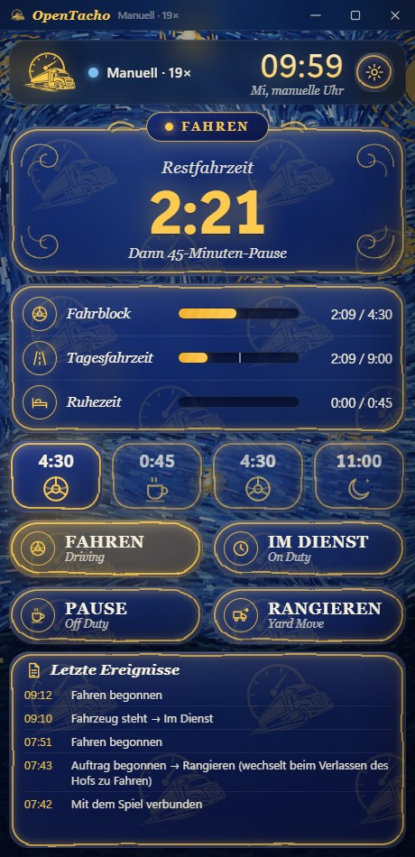
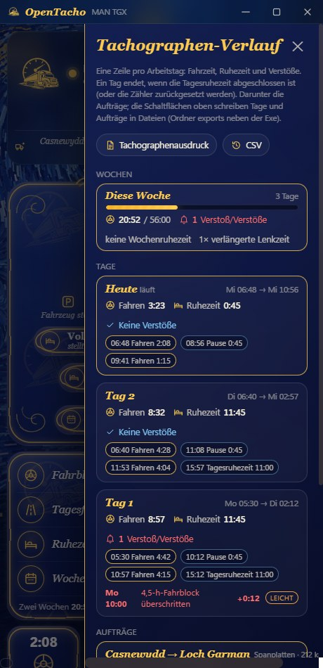
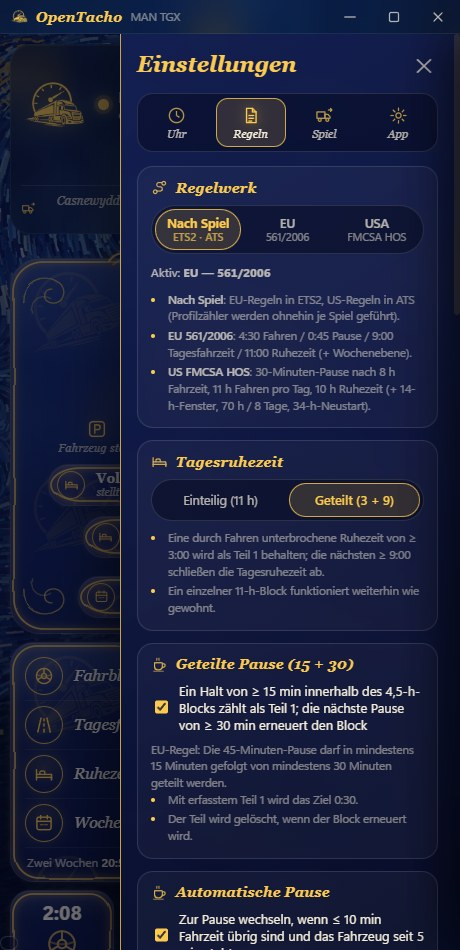
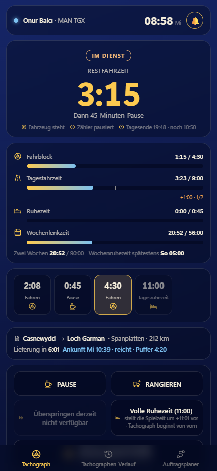

# OpenTacho

[English](README.md) · [Türkçe](README.tr.md) · **Deutsch** · [Русский](README.ru.md) · [Polski](README.pl.md) · [Português (Brasil)](README.pt-BR.md) · [Español](README.es.md) · [Français](README.fr.md) · [Italiano](README.it.md) · [Čeština](README.cs.md)

Ein kleiner, konsequenter Lenkzeit-Tachograph für **Euro Truck Simulator 2** und
**American Truck Simulator** — eine Regel, kein Schnickschnack, komplett in **Spielzeit** gemessen:

> **4:30 Fahren → 0:45 Pause → 4:30 Fahren → 11:00 Tagesruhezeit** (oder geteilt **3:00 + 9:00**)

Er liest Spieluhr, Geschwindigkeit, Lkw und Auftragsdaten live aus dem Spiel, zeigt, was dir
noch bleibt, und kümmert sich um die unangenehmen Fälle (Fähren, Schlafen, Zeitzonen, geladene
Spielstände, Anhänger beladen), damit du einfach fahren kannst.

**Nur Windows 10/11** — das Telemetrie-Plugin teilt seine Daten über den gemeinsamen Speicher von Windows, und die App nutzt Windows-APIs für Hotkey, Töne und den Konsolenbefehl. Linux (natives ETS2 / Proton) und macOS werden nicht unterstützt.

<p align="center">
  
  
  
</p>
<p align="center">
  
</p>
<p align="center">
  
</p>

## Schnellstart

1. **[OpenTacho-win64.zip](https://github.com/onurbalcii/OpenTacho/releases/latest/download/OpenTacho-win64.zip)**
   herunterladen (alle Versionen: [Releases](https://github.com/onurbalcii/OpenTacho/releases)) und irgendwo entpacken.
2. **`plugin\scs-telemetry.dll`** in den Plugin-Ordner des Spiels kopieren
   (`…\Euro Truck Simulator 2\bin\win_x64\plugins\` — `plugins` anlegen, falls nicht vorhanden;
   bei ATS genauso). Das Spiel einmal starten und die SDK-Abfrage bestätigen.
3. **`OpenTacho.exe`** starten. Das war's — alles andere ist dabei. Beim ersten Start wählst du
   deine Sprache und bekommst eine kurze Einführung.

Für die ⏩ Überspringen-Schaltfläche die Entwicklerkonsole im Spiel aktivieren: in
`Documents\Euro Truck Simulator 2\config.cfg` `g_console "1"` und `g_developer "1"` setzen.
Die Schaltfläche bleibt gesperrt, bis beides aktiv ist.

Öffnet sich das Fenster gar nicht, installiere Microsofts kostenlose
[WebView2 Runtime](https://developer.microsoft.com/microsoft-edge/webview2/) — sie ist in Windows 11 und in jedem
aktuellen Windows 10 bereits enthalten, daher ist das selten nötig.

## Empfohlene Nutzung — wichtig

Damit OpenTacho sein volles Potenzial ausspielt, nimm die Müdigkeitsmechanik des Spiels aus dem Spiel und
überspringe Ruhezeiten über die App:

1. **Müdigkeitssimulation im Spiel ausschalten** — ETS2/ATS: *Optionen → Gameplay → Müdigkeitssimulation*
   (Haken entfernen). Die Müdigkeitsuhr des Spiels hat nichts mit der EU-Regel zu tun: bleibt sie an, kann dich
   das Spiel zum Schlafen zwingen, obwohl der Tachograph noch Lenkzeit anzeigt — oder dich weiterfahren lassen,
   wenn der Tachograph Stopp sagt.
2. **Die Schlaffunktion des Spiels nicht nutzen** (Rastplätze, „Schlafen“ im Hotel). Das sind generische
   Zeitsprünge, die die App erst deuten muss: sie hält sie 30 s zurück, um Beladen von Ruhen zu unterscheiden,
   und das Spiel bestimmt die Schlafdauer — oft nicht die 11 h, die eine Tagesruhezeit braucht, die Ruhezeit
   bleibt also unvollständig.
3. **Pausen und Ruhezeiten über die App überspringen** — ist die Lenkzeit aufgebraucht, Lkw anhalten und
   ⏩ **Überspringen** (45-Minuten-Pause / 11 h Ruhezeit) oder **Volle Ruhezeit** drücken. Die App stellt die
   Spieluhr per `g_set_time` um genau die nötige Zeit vor und schreibt sie sofort, auf die Minute, in die Zähler.
   Dafür muss die Spielkonsole aktiv sein (`config.cfg`: `g_console "1"`, `g_developer "1"`).

Ergebnis: eine einzige, stimmige Zeitlinie — Lenkzeit, Pausen, Tagesruhezeiten und der Tachographen-Verlauf
entsprechen genau dem, was du tatsächlich gemacht hast.

## Funktionen

- **Live aus dem Spiel** – Uhr, Geschwindigkeit, Lkw-Modell, aktiver Auftrag (Route, Fracht, Zeit bis zur Lieferung).
- **Fahren / Im Dienst aus der Geschwindigkeit erkannt**; **Pause** und **Rangieren** per Knopfdruck.
- **Automatische Pause**, wenn die Fahrzeit fast aufgebraucht ist und der Lkw eine Weile steht.
- **Geteilte Pause (15 + 30)**: ein Halt von ≥ 15 min im 4,5-h-Block wird als Teil 1 behalten;
  eine spätere Pause von ≥ 30 min erneuert den Block (EU-Regel). Abschaltbar.
- **Geteilte Tagesruhezeit (3 + 9)** mit einer Tagesablauf-Leiste, die jeden abgeschlossenen Block,
  den aktuellen und den Plan zeigt; eine einteilige 11-h-Ruhezeit funktioniert weiterhin. Kann auf einteilig festgelegt werden.
- **Auftragsplaner**: Entfernung und Lieferzeit aus dem Angebot eintragen — die App simuliert Pausen und Tages-/Wochenruhezeiten
  mit deinen aktuellen Kontingenten und liefert Gesamtzeit, Ankunft und Puffer (**reicht / reicht nicht**); bei angenommenem
  Auftrag kommen Routenzeit und Lieferfenster aus dem Spiel, das Ergebnis steht live in der Auftragszeile. Der Durchschnitt wird vom Kilometerzähler gelernt;
  eine **Fähre/Zug**-Überfahrt auf der Route wird aus der Routenzeit geschätzt (zählt als Ruhe) und kann auch manuell eingegeben werden.
- **Spielprofil**: das aktive Profil wird erkannt (Name · Level · Firma in der oberen Karte); Zähler, Verlauf und Ereignisse werden
  **pro Profil** geführt — beim Profilwechsel im Spiel wechselt die App die Zähler (Ordner `profiles\`).
- **Strenger Modus** (optional): Pausen und Ruhezeiten zählen nur bei **Motor aus + Feststellbremse**; das Hauptfeld zeigt, warum nichts zählt.
- **Verstoßschwere**: jeder Verstoß wird nach den EU-Klassen eingestuft (leicht / schwer / sehr schwer); optionale **virtuelle Bußgelder** (€, ungefähr); ein **Bezahlen**-Knopf überträgt sie ins Spiel — eine Kopie des neuesten Spielstands mit vom Bankkonto abgezogenem Bußgeld wird in einen neuen Slot „OpenTacho: Bußgeld bezahlt“ geschrieben und im Spiel über Laden geladen.
- **Sprachansagen**: kurze Sätze mit der Offline-Stimme von Windows („noch 15 Minuten Lenkzeit“, „Pause abgeschlossen“ …), in jeder App-Sprache; getrennte Lautstärkeregler für Warnton und Ansagen.
- **Wochenregeln** (optional, Einstellungen → Regeln; Standard: einfacher Modus): **56 h** pro Woche / **90 h** in zwei
  Wochen (Spiel-Kalenderwoche), Tageslenkzeit zweimal pro Woche auf **10 h** verlängert, Tagesruhezeit dreimal pro Woche
  auf **9 h** verkürzt, **Tagesspanne** (Ruhezeit muss innerhalb von 13/15 h beginnen; im Hauptfeld als „Tagesende“),
  **Wochenruhezeit** 45 h / verkürzt 24 h (fällig innerhalb von 6 Tagen; eine Schaltfläche überspringt sie in zwei Schritten),
  Wochenkarten im Verlauf, neue Verstoßarten.
- **US-Regelwerk (FMCSA HOS)** für American Truck Simulator, automatisch nach Spiel gewählt (Einstellungen → Regeln
  erzwingt EU oder USA): **30-Minuten-Pause nach 8 h** Fahrzeit, **11 h** Fahren pro Tag, **10 h** Ruhezeit; die
  optionale US-Ebene ergänzt das **14-Stunden-Fenster** (14 h nach der ersten Fahrt des Tages endet die Fahrzeit, Pausen
  verlängern es nicht), den **70 h / 8 Tage**-Zyklus und den **34-Stunden-Neustart** (per Knopf überspringbar). Balken,
  Planer, Verlauf, Ausdrucke und Sprachansagen folgen dem aktiven Regelwerk. Die Schlafkabinen-Teilung (7/3) wird nicht abgebildet.
- **Zeitsprünge verarbeitet**: Schlafen / Fähre / Zug zählen als Ruhezeit; **Anhänger be- und
  entladen nicht**; das Laden eines Spielstands setzt die Zähler auf diesen Moment zurück.
- **Modus „Kein Auftrag“**: ohne aktive Lieferung zählt nichts (Ruhezeit optional weiterhin). Eine
  GPS-Route startet eine vorläufige Zählung, die rückgängig gemacht wird, wenn du den Auftrag nie annimmst.
- **Rangier-Automatik**: schaltet sich beim Auftragsbeginn und nahe dem Lieferbereich ein, über 40 km/h aus.
- **Lokale Zeitzonen**: das HUD zeigt die Ortszeit des Landes; die App liest die Zone aus dem
  neuesten Spielstand, damit beide Uhren übereinstimmen.
- **⏩ Überspringen**: sendet `g_set_time` an die Spielkonsole, um eine Pause oder Ruhezeit vorzuspulen. Steht der Lkw,
  erscheint zusätzlich **Volle Ruhezeit**: überspringt die komplette 11-h-Tagesruhezeit auf einmal (neuer Auftrag mit frischen Zählern).
- **Tachographen-Verlauf**: eine Liste über den Knopf unter dem Zahnrad — Fahr- und Ruhezeiten pro Tag,
  Abschnitte (Uhrzeit, Dauer) und Verstöße (4,5-h-Block / 9 h Tagesfahrzeit überschritten, mit Uhrzeit und Überschreitung), wie ein echter Tachographenausdruck.
  Der Knopf daneben wechselt ohne Umweg über die Einstellungen zur Mini-Leiste.
- **Auftragsprotokoll und Export**: jede Ladung wird aus den Telemetrie-Ereignissen erfasst — Route, Fracht, km,
  Fahr-/Pausen-/Verstoßzähler, Einnahme und Verspätung bei Lieferung, Abbruchstrafe, Bußgelder des Spiels. Unten im
  Verlaufs-Panel gelistet; **Tachographenausdruck** (gestaltetes PDF + txt, wie ein DTCO-24-h-Ausdruck: Tageszeitleiste, Abschnitte, Verstöße, Aufträge) und **CSV** (Tage + Aufträge)
  schreiben alles in den Ordner `exports` neben der Exe.
- **Tonwarnungen**: ein kurzer Ton 15 min vor Ende der Fahr-/Ruhezeit, zweimal bei einem Verstoß,
  einmal beim Abschluss einer Pause/Ruhezeit (abschaltbar; `.wav`-Dateien austauschen, um ihn zu ändern).
- **Mini-Leiste**: ein globaler Hotkey (Standard `Strg + Num 0`, änderbar) tauscht das Fenster gegen eine
  kleine, immer sichtbare Anzeige über dem Spiel — Statussymbol, Restzeit, nächster Schritt, Mini-Balken (Block ·
  Tag · Ruhe · Woche/Zyklus), Spieluhr, Markierungen, Lieferfrist mit Planer-Urteil und Schaltflächen für Pause /
  Rangieren / Überspringen / Volle Ruhezeit / Wochenruhezeit — frei verschiebbar; Deckkraft und Größe (70–160 %) einstellbar.
- **Designs**: Van Gogh (Standard, ein algorithmisch gemalter Hintergrund im Stil der *Sternennacht*
  mit Glasflächen), schlicht dunkel, schlicht hell und **Eigenes**: dein eigenes Hintergrundbild (JPG/PNG/WebP) plus
  ein Canvas-Farbwähler für Fenster- und Akzentfarbe (RGB/HEX; Textfarbe automatisch, die Mini-Leiste folgt denselben Farben).
  Bildanordnung: füllen, einpassen, mittig, kacheln oder strecken; das eigene Design nutzt den schlichten flachen Look.
- **Sprachen**: Deutsch, Englisch, Türkisch, Russisch, Polnisch, brasilianisches Portugiesisch, Spanisch, Französisch,
  Italienisch, Tschechisch — eine neue Sprache ist eine einzige JSON-Datei.
- **Zweitbildschirm auf Handy oder Tablet** (Einstellungen → App → *Auf Handy oder Tablet nutzen* oder der
  Telefon-Knopf unter dem Zahnrad): LAN-Freigabe einschalten und den QR-Code scannen — ein Gerät im selben WLAN
  zeigt den Tachographen im Browser, ohne App: Status, Restzeit, Balken, Tagesablauf, Auftrag mit ETA, Markierungen,
  Ereignisse sowie Verlaufs- und Planer-Reiter. Pause / Rangieren / Überspringen / Volle Ruhezeit funktionieren vom
  Handy (abschaltbar); die Seite hält den Bildschirm wach und piept/vibriert bei Warnungen. Der Link trägt einen
  zufälligen Schlüssel, nichts ist im Internet erreichbar, bei ausgeschalteter Freigabe lauscht nichts. Die
  Windows-Firewall fragt einmal — für private Netzwerke erlauben.
- **Update-Prüfung**: beim Start fragt die App GitHub nach der neuesten Version (abschaltbar) und zeigt bei einer
  neueren Version ein Banner mit Download-Schaltfläche; Einstellungen → App zeigt Version, manuelle Prüfung und Download-Link.
- **Erster Start**: Sprachauswahl, dann eine kurze Einführung in Bildschirm und Einstellungsreiter
  (jederzeit neu startbar unter Einstellungen → App).
- Merkt sich Fensterposition/-größe, Option „immer im Vordergrund“, Ereignisprotokoll, Feedback-Schaltfläche.

## So wird gezählt

| Situation | Was passiert |
|---|---|
| Fahrt > 5 km/h | Fahren. Halte kürzer als ~2 Spielminuten (Ampeln) bleiben Fahren. |
| Stillstand | Im Dienst – Fahrzeit pausiert, Ruhezeit zählt nicht. |
| Schaltfläche **Pause** | Ruhezeit zählt; endet automatisch, sobald der Lkw fährt. |
| **Rangieren** | Bewegung zählt nicht als Fahren; Ruhezeit pausiert, wird nicht verworfen. |
| Zeitsprung (Schlaf, Fähre, Zug) | Als Ruhezeit gezählt. Fähre/Zug und das eigene Überspringen sofort; andere Sprünge warten bis zu 30 s, falls ein Auftragsereignis sie als Beladung ausweist. |
| Zeitsprung beim Be-/Entladen | Ignoriert (erkannt über Fracht-geladen-Flag / Auftragsereignisse). |
| Halt von 15–44 min, durch Fahren unterbrochen | Als Pause Teil 1 behalten; eine spätere 30-min-Pause erneuert den 4,5-h-Block. |
| Ruhezeit ≥ 3:00, durch Fahren unterbrochen | Als Teil 1 einer geteilten Ruhezeit behalten; 9:00 später schließt den Tag ab. |
| Spielzeit läuft rückwärts | Spielstand geladen → Zähler aus dem Minutenverlauf wiederhergestellt. |
| Wochenregeln aktiv | Restlenkzeit = kleinstes von Block / Tag / Woche / zwei Wochen; Tagesende und Wochenruhezeit-Termin im Hauptfeld; eine Ruhezeit ≥ 24 h zählt als verkürzte, ≥ 45 h als volle Wochenruhezeit. |
| Kein aktiver Auftrag und keine GPS-Route | Kein Auftrag: nichts läuft weiter. |

Alles liegt in `state.json` / `history.json` neben `OpenTacho.exe`; lösche sie, um neu zu
beginnen (oder nutze *Zähler zurücksetzen* in den Einstellungen).

## FAQ

**Gibt es einen Tachographen / Lenkzeit-Tracker für Euro Truck Simulator 2 oder American Truck Simulator?**
Ja — genau das ist OpenTacho. Es zählt Lenkzeit, Pausen und Tagesruhezeit in Spielzeit und
liest das Spiel live über das Telemetrie-Plugin scs-sdk-plugin.

**Welche Regel gilt?**
Zwei Regelwerke, nach Spiel oder manuell gewählt (Einstellungen → Regeln): die EU-Regel (561/2006) — 4:30 Fahren →
45 Minuten Pause → 4:30 Fahren → 11 Stunden Tagesruhezeit, die geteilte Pause 15 + 30, die geteilte Tagesruhezeit 3 + 9
und eine optionale Wochenebene (56/90 h, 10-h-Verlängerung, 9 h verkürzte Ruhezeit, Tagesspanne, Wochenruhezeit) — und
die US-FMCSA-Lenkzeitregel für American Truck Simulator (8 h / 30 min / 11 h / 10 h, optional 14-h-Fenster, 70 h / 8 Tage,
34-h-Neustart).

**Braucht es Internet oder ein Konto?**
Kein Konto, und alles wird lokal und offline gezählt; nichts wird hochgeladen. Nach außen gehen nur die optionale
Update-Prüfung (liest die Infos zur neuesten Version von GitHub, abschaltbar) und die Feedback-Schaltfläche, die ein
Webformular im Browser öffnet. Der Zweitbildschirm auf Handy/Tablet bleibt im lokalen Netzwerk.

**Funktioniert es mit Karten-Mods, ProMods oder ATS?**
Ja. Es liest nur Telemetrie (Uhr, Geschwindigkeit, Auftrag), Karten- und Lkw-Mods spielen
also keine Rolle; American Truck Simulator nutzt dasselbe Plugin — in ATS gilt automatisch das US-FMCSA-Regelwerk
(8 h / 30 min / 11 h / 10 h, 14-h-Fenster, 70 h / 8 Tage); unter Einstellungen → Regeln lässt sich jedes Regelwerk erzwingen.

**Das Handy kann die Seite nicht öffnen / der QR-Code funktioniert nicht.**
Beide Geräte müssen im selben lokalen Netzwerk sein (gleicher Router oder Hotspot des Handys); Gastnetze mit
„AP-Isolation“ blockieren das. OpenTacho in der Windows-Firewall für private Netzwerke erlauben (fragt beim
ersten Mal); zeigt die Adresse das falsche Netz, unter *Netzwerkadresse* ein anderes wählen. *Neuer Code* macht
alte Links ungültig.

**Die Mini-Leiste erscheint nicht über dem Spiel.**
Windows kann über ein Spiel im *exklusiven Vollbild* kein Overlay zeichnen. Stelle den Anzeigemodus
des Spiels auf *Fenster* oder *randloses Vollbild* (ETS2: Optionen → Grafik → Vollbild aus) — dann
liegt die Leiste oben, und das Spiel scheint durch ihren transparenten Hintergrund.

**Sind die wöchentlichen 56 / 90 h enthalten?**
Ja, optional: Einstellungen → Regeln → *Wochenregeln anwenden*. Standard ist der einfache Modus (nur 4:30 / 45 / 11);
eingeschaltet kommen Wochen- und Zwei-Wochen-Lenkzeit, die 10-h-Verlängerung, die 9-h-Verkürzung, die Tagesspanne und die 45-h-Wochenruhezeit dazu.

**Soll die Müdigkeitssimulation des Spiels an bleiben?**
Nein. Ausschalten (*Optionen → Gameplay*) und Pausen/Ruhezeiten mit ⏩ Überspringen / Volle Ruhezeit der App
statt mit Schlafen im Spiel überspringen — siehe *Empfohlene Nutzung* oben. Die Müdigkeitsuhr des Spiels folgt
nicht der EU-Regel, und der Schlaf im Spiel dauert selten die 11 h einer Tagesruhezeit.

**Was unterscheidet es von ELD-artigen Lenkzeit-Apps?**
Es ist eine leichte Open-Source-Alternative (MIT): EU- und US-Regelwerk, kein Konto, offline, ein
einzelner portabler Ordner mit `.exe`, und es kümmert sich um Fähren, Schlafen, Zeitzonen und
geladene Spielstände.

## Ordnerstruktur

```
OpenTacho.exe          die App (Release-Build)             OpenTacho.py   dieselbe App, aus dem Quellcode
plugin/                scs-telemetry.dll → in den plugins-Ordner des Spiels kopieren
app/                   Fensterinhalt: main.html, mini.html, mobile.html, assets/ (Logo, Hintergrund, Töne)
lang/                  en, tr, de, ru, pl, pt-BR, es, fr, it, cs — eine JSON-Datei pro Sprache
lib/                   SII_Decrypt.dll (Zeitzonen-Funktion)
docs/screenshots/      die Bilder dieser READMEs
third_party/           Lizenzen der mitgelieferten Komponenten
tools/                 build.bat (PyInstaller), Asset-Generatoren
```

## Aus dem Quellcode starten / bauen

```powershell
git clone https://github.com/onurbalcii/OpenTacho.git
cd OpenTacho
pip install -r requirements.txt
python OpenTacho.py
```

`pip install pyinstaller` und `tools\build.bat` erzeugen `dist\OpenTacho\OpenTacho.exe` und
`dist\OpenTacho-win64.zip` (das Release-Paket). Benötigt Windows 10/11 mit WebView2 (in Windows enthalten).

## Eine Sprache hinzufügen

Kopiere `lang/en.json` nach `lang/<code>.json`, übersetze die Werte (behalte die `{Platzhalter}`
und die `<b>`/`<code>`-Tags), setze `"_name"`. Die neue Sprache erscheint automatisch unter
Einstellungen → App und in der Sprachauswahl beim ersten Start.

## Komponenten Dritter und Lizenzen

Siehe [`third_party/README.md`](third_party/README.md). OpenTacho steht unter der MIT-Lizenz
([LICENSE](LICENSE)). Es ist ein Fan-Projekt und steht in keiner Verbindung zu SCS Software.
