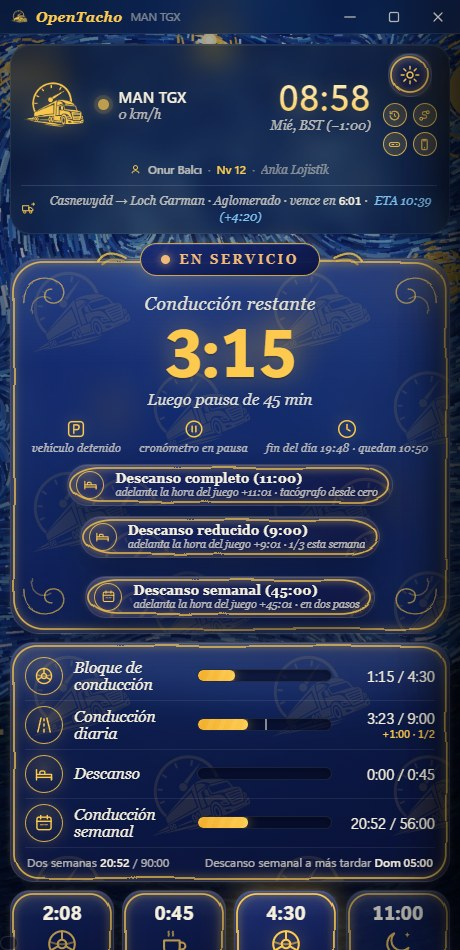
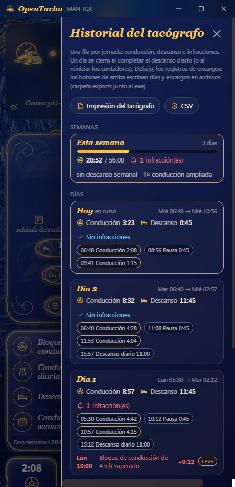
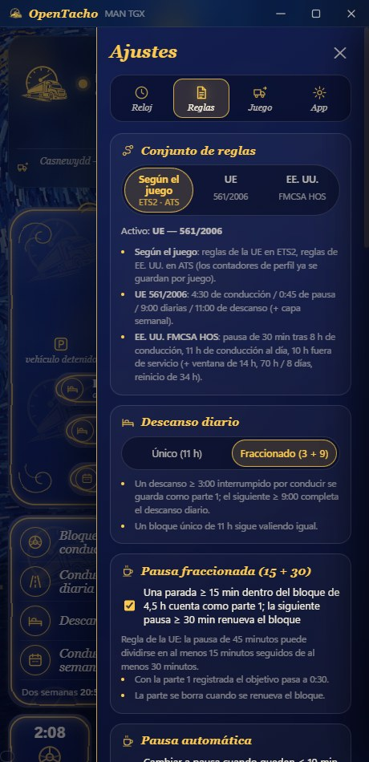
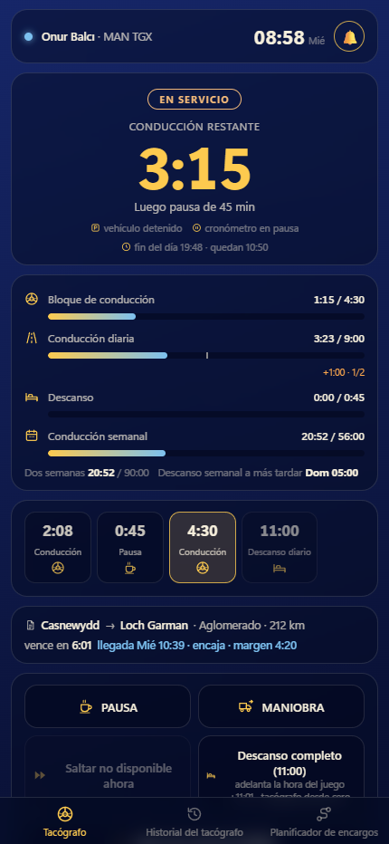

# OpenTacho

[English](README.md) · [Türkçe](README.tr.md) · [Deutsch](README.de.md) · [Русский](README.ru.md) · [Polski](README.pl.md) · [Português (Brasil)](README.pt-BR.md) · **Español** · [Français](README.fr.md) · [Italiano](README.it.md) · [Čeština](README.cs.md)

Un tacógrafo de tiempos de conducción pequeño y sin rodeos para **Euro Truck Simulator 2** y
**American Truck Simulator** — una regla, sin complicaciones, medida por completo en **tiempo del juego**:

> **4:30 de conducción → 0:45 de pausa → 4:30 de conducción → 11:00 de descanso diario** (o fraccionado en **3:00 + 9:00**)

Lee en vivo el reloj del juego, la velocidad, el camión y los datos del encargo, muestra lo que te queda
y se ocupa de los casos incómodos (ferris, sueño, zonas horarias, partidas recargadas, carga del remolque) para que solo conduzcas.

**Solo Windows 10/11** — el plugin de telemetría comparte los datos mediante la memoria compartida de Windows y la app usa APIs de Windows para la tecla rápida, los sonidos y el comando de consola. Linux (ETS2 nativo / Proton) y macOS no están soportados.

<p align="center">
  
  
  
</p>
<p align="center">
  
</p>
<p align="center">
  
</p>

## Inicio rápido

1. Descarga **[OpenTacho-win64.zip](https://github.com/onurbalcii/OpenTacho/releases/latest/download/OpenTacho-win64.zip)**
   (todas las versiones: [Releases](https://github.com/onurbalcii/OpenTacho/releases)) y extráelo donde quieras.
2. Copia **`plugin\scs-telemetry.dll`** a la carpeta de plugins del juego
   (`…\Euro Truck Simulator 2\bin\win_x64\plugins\` — crea `plugins` si no existe;
   igual para ATS). Inicia el juego una vez y acepta el aviso del SDK.
3. Ejecuta **`OpenTacho.exe`**. Eso es todo — lo demás viene en la caja. El primer inicio pregunta
   tu idioma y ofrece un breve recorrido guiado.

Para el botón ⏩ Saltar, activa la consola de desarrollador en el juego: en
`Documents\Euro Truck Simulator 2\config.cfg` pon `g_console "1"` y `g_developer "1"`.
El botón queda bloqueado hasta que ambos estén activos.

Si la ventana no se abre en absoluto, instala el
[WebView2 Runtime](https://developer.microsoft.com/microsoft-edge/webview2/) gratuito de Microsoft — ya forma parte de
Windows 11 y de cualquier Windows 10 actualizado, así que rara vez hace falta.

## Configuración recomendada — importante

Para sacar el máximo partido a OpenTacho, deja fuera la mecánica de fatiga del propio juego y salta los descansos
desde la app:

1. **Desactiva la simulación de fatiga del juego** — ETS2/ATS: *Opciones → Jugabilidad → Simulación de fatiga*
   (desmarca). El reloj de fatiga del juego no tiene nada que ver con la regla de la UE: activado, puede obligarte a dormir
   mientras el tacógrafo aún muestra tiempo de conducción — o dejarte seguir cuando el tacógrafo dice que pares.
2. **No uses el sueño del juego** (áreas de descanso, la acción "dormir" del hotel). Son saltos de tiempo genéricos que la
   app tiene que interpretar: los retiene 30 s para distinguir carga de descanso, y el juego decide cuánto
   has dormido — casi nunca las 11 h que exige un descanso diario, así que el descanso queda incompleto.
3. **Salta pausas y descansos desde la app** — cuando se agote el tiempo de conducción, detén el camión y pulsa
   ⏩ **Saltar** (pausa de 45 min / descanso de 11 h) o **Descanso completo**. La app adelanta el reloj del juego exactamente lo
   necesario con `g_set_time` y lo acredita en los contadores al instante, al minuto. Requiere la
   consola del juego (`config.cfg`: `g_console "1"`, `g_developer "1"`).

Resultado: una línea de tiempo coherente — tiempo de conducción, pausas, descansos diarios e historial del tacógrafo
coinciden con lo que realmente hiciste.

## Funciones

- **En vivo desde el juego** – reloj, velocidad, modelo del camión, encargo activo (ruta, carga, tiempo para entregar).
- **Conducción / en servicio detectados por la velocidad**; **Pausa** y **Maniobra** son botones de un toque.
- **Pausa automática** cuando el tiempo de conducción casi se agota y el camión lleva un rato detenido.
- **Pausa fraccionada (15 + 30)**: una parada ≥ 15 min dentro del bloque de 4,5 h se guarda como parte 1; una
  pausa posterior ≥ 30 min renueva el bloque (regla de la UE). Se puede desactivar.
- **Descanso diario fraccionado (3 + 9)** con una franja de flujo del día que muestra cada bloque completado, el
  actual y el plan; el descanso único de 11 h sigue funcionando. Se puede fijar en único.
- **Planificador de encargos**: escribe la distancia y el plazo de entrega de la oferta — la app simula pausas y descansos diarios/semanales con
  tus márgenes actuales y da el tiempo total, la llegada y el margen (**encaja / no encaja**); con un encargo aceptado, el tiempo de ruta
  y la ventana de entrega vienen del juego y el resultado se muestra en vivo en la línea del encargo. La velocidad media se aprende del odómetro; una travesía de **ferry/tren**
  en la ruta se estima a partir del tiempo de ruta (contada como descanso) y también se puede introducir a mano.
- **Perfil del juego**: se reconoce el perfil activo (nombre · nivel · empresa en la tarjeta superior); contadores, historial y eventos se
  guardan **por perfil** — cambia de perfil en el juego y la app cambia los contadores (carpeta `profiles\`).
- **Modo estricto** (opcional): pausas y descansos solo cuentan con el **motor apagado + freno de estacionamiento puesto**; el panel principal muestra por qué no cuenta nada.
- **Gravedad de las infracciones**: cada infracción se clasifica según las clases de la UE (leve / grave / muy grave); **multas virtuales** opcionales (€, aproximadas); un botón **Pagar** las refleja en el juego — una copia de tu partida más reciente con la multa descontada de la cuenta bancaria se escribe en una nueva ranura llamada "OpenTacho: multa pagada", para cargarla desde el menú Cargar del juego.
- **Avisos por voz**: frases cortas con la voz sin conexión de Windows ("quedan 15 minutos de tiempo de conducción", "pausa completada"…), en todos los idiomas de la app; controles de volumen separados para el sonido de alerta y la voz.
- **Reglas semanales** (opcional, Ajustes → Reglas; modo simple por defecto): conducción semanal de **56 h** / quincenal de **90 h**
  (semana natural del juego), conducción diaria ampliada a **10 h** dos veces por semana, descanso diario reducido a **9 h** tres
  veces por semana, **amplitud del día** (el descanso debe empezar antes de 13/15 h; se muestra como "fin del día" en el panel principal), **descanso semanal**
  45 h / reducido 24 h (antes de 6 días; un botón lo salta en dos pasos), tarjetas semanales en el historial, nuevos tipos de infracción.
- **Conjunto de reglas de EE. UU. (FMCSA HOS)** para American Truck Simulator, elegido automáticamente según el juego (Ajustes → Reglas
  permite forzar UE o EE. UU.): **pausa de 30 min tras 8 h** de conducción, **11 h** de conducción al día, **10 h** fuera de servicio;
  la capa opcional de EE. UU. añade la **ventana de 14 horas** (la conducción termina 14 h después de la primera conducción del día, las pausas no
  la amplían), el ciclo de **70 h / 8 días** en servicio y el **reinicio de 34 horas** (un botón lo salta). Barras, planificador,
  historial, impresiones y textos de voz siguen el conjunto activo. El fraccionamiento en litera (7/3) no está modelado.
- **Saltos de tiempo gestionados**: dormir / ferry / tren cuentan como descanso; **la carga y descarga del remolque
  no**; cargar una partida devuelve los contadores a ese momento.
- **Modo sin encargo**: sin entrega activa → nada cuenta (el descanso opcionalmente sí). Fijar una
  ruta en el GPS inicia un recuento provisional que se revierte si nunca aceptas el encargo.
- **Maniobra automática**: se activa al empezar un encargo y cerca de la zona de entrega, se desactiva por encima de
  40 km/h.
- **Zonas horarias locales**: el HUD muestra la hora local del país; la app lee la zona de la
  partida más reciente para que ambos relojes coincidan.
- **⏩ Saltar**: envía `g_set_time` a la consola del juego para adelantar una pausa o descanso. Con el camión
  detenido aparece también un botón **Descanso completo**: salta de una vez todo el descanso diario de 11 h (empieza un nuevo encargo con los contadores a cero).
- **Historial del tacógrafo**: una lista que se abre desde el botón bajo el engranaje — totales de conducción y descanso por día,
  segmentos (hora, duración) e infracciones (bloque de 4,5 h / 9 h diarias superados, con hora y exceso), como una impresión de tacógrafo real.
  El botón de al lado cambia a la barra mini sin abrir los ajustes.
- **Registros de encargos y exportación**: cada carga se registra a partir de los eventos de telemetría — ruta, carga, km, recuentos de conducción / pausas /
  infracciones, ingresos y retraso de la entrega, penalización por cancelar, multas del juego. Se listan al final del panel de historial;
  los botones **Impresión del tacógrafo** (PDF cuidado + txt, como una impresión DTCO de 24 h: línea de tiempo del día, segmentos, infracciones, encargos) y **CSV** (días + encargos) escriben todo
  en la carpeta `exports` junto al exe.
- **Alertas sonoras**: un aviso corto 15 min antes de que termine la conducción/el descanso, dos veces en una
  infracción, una vez cuando termina una pausa/descanso (se puede silenciar; cambia los archivos `.wav` para modificarlo).
- **Barra mini**: una tecla rápida global (por defecto `Ctrl + Num 0`, configurable) sustituye la ventana por un
  pequeño indicador siempre visible sobre el juego — icono de estado, tiempo restante, siguiente paso, mini barras (bloque · diario ·
  descanso · semanal/ciclo), reloj del juego, indicadores, plazo de entrega con el veredicto del planificador y botones Pausa / Maniobra /
  Saltar / Descanso completo / Descanso semanal — arrástrala donde quieras; opacidad y tamaño (70–160 %) ajustables.
- **Temas**: Van Gogh (por defecto, un fondo pintado por algoritmo al estilo de *La noche estrellada* con
  paneles de cristal), oscuro simple, claro simple y **Personalizado**: tu propia imagen de fondo (JPG/PNG/WebP) más un
  selector de color en lienzo para los colores de ventana y de acento (RGB/HEX; el color del texto se elige automáticamente, la barra mini
  usa los mismos colores). Colocación de la imagen: rellenar, ajustar, centrar, mosaico o estirar; el tema personalizado usa el aspecto plano del tema simple.
- **Idiomas**: inglés, turco, alemán, ruso, polaco, portugués de Brasil, español, francés, italiano,
  checo — añadir uno es un único archivo JSON.
- **Segunda pantalla en el móvil o la tableta** (Ajustes → App → *Usar en el móvil o la tableta*, o el botón de teléfono bajo
  el engranaje): activa el compartir en la red local y escanea el código QR — un dispositivo en la misma Wi-Fi muestra el tacógrafo en su
  navegador, sin app: estado, tiempo restante, barras, flujo del día, encargo con ETA, indicadores, eventos, además de pestañas de historial y planificador.
  Pausa / Maniobra / Saltar / Descanso completo funcionan desde el móvil (se puede desactivar); la página mantiene la pantalla encendida
  y suena/vibra en los avisos. El enlace lleva una clave aleatoria, nada se expone a internet y nada
  escucha con el compartir desactivado. El Firewall de Windows pregunta una vez — permítelo para redes privadas.
- **Comprobación de actualizaciones**: al iniciar, la app consulta a GitHub la última versión (se puede desactivar) y muestra una
  franja con botón de descarga cuando hay una versión más nueva; Ajustes → App muestra la versión, una comprobación manual
  y el enlace de descarga.
- **Primer inicio**: un selector de idioma y luego un breve recorrido guiado por la pantalla y las pestañas de ajustes
  (reinícialo cuando quieras desde Ajustes → App).
- Recuerda la posición/tamaño de la ventana, la opción siempre visible, el registro de eventos, botón de comentarios.

## Cómo cuenta

| Situación | Qué ocurre |
|---|---|
| En movimiento > 5 km/h | Conducción. Las paradas menores de ~2 minutos de juego (semáforos) siguen siendo conducción. |
| Detenido | En servicio – cronómetro de conducción en pausa, el descanso no cuenta. |
| Botón **Pausa** | El descanso cuenta; termina automáticamente cuando el camión se mueve. |
| **Maniobra** | El movimiento no cuenta como conducción; el descanso queda en pausa, no se descarta. |
| Salto de tiempo (sueño, ferry, tren) | Contado como descanso. Ferry/tren y el propio salto de la app se acreditan al instante; otros saltos esperan hasta 30 s por si un evento de encargo los marca como carga. |
| Salto de tiempo al cargar/descargar | Ignorado (detectado por la marca de carga / eventos de encargo). |
| Parada de 15–44 min interrumpida por conducir | Guardada como parte 1 de la pausa; una pausa posterior de 30 min renueva el bloque de 4,5 h. |
| Descanso ≥ 3:00 interrumpido por conducir | Guardado como parte 1 de un descanso fraccionado; 9:00 después completan el día. |
| El tiempo del juego retrocede | Partida recargada → contadores restaurados desde el historial por minuto. |
| Sin encargo activo y sin ruta en el GPS | Sin encargo: nada avanza. |
| Reglas semanales activadas | Conducción restante = el menor de los márgenes de bloque / diario / semanal / quincenal; plazos de fin del día y descanso semanal en el panel principal; un descanso ≥ 24 h cuenta como reducido, ≥ 45 h como descanso semanal completo. |

Todo se guarda en `state.json` / `history.json` junto a `OpenTacho.exe`; bórralos para
empezar de cero (o usa *Reiniciar contadores* en los ajustes).

## Preguntas frecuentes

**¿Existe un tacógrafo / control de tiempos de conducción para Euro Truck Simulator 2 o American Truck Simulator?**
Sí — eso es exactamente OpenTacho. Cuenta tiempo de conducción, pausas y descanso diario en tiempo
del juego y lee el juego en vivo mediante el plugin de telemetría scs-sdk-plugin.

**¿Qué regla sigue?**
Dos conjuntos de reglas, elegidos según el juego o a mano (Ajustes → Reglas): la regla de la UE (561/2006) — 4:30 de conducción →
pausa de 45 minutos → 4:30 de conducción → 11 horas de descanso diario, la pausa fraccionada 15 + 30, el descanso diario fraccionado 3 + 9 y una
capa semanal opcional (56/90 h, ampliación a 10 h, descanso reducido de 9 h, amplitud del día, descanso semanal) — y la regla FMCSA
de EE. UU. para American Truck Simulator (8 h / 30 min / 11 h / 10 h, ventana de 14 h opcional, 70 h / 8 días,
reinicio de 34 h).

**¿Necesita conexión a internet o una cuenta?**
Sin cuenta, y todo se cuenta localmente y sin conexión; no se sube nada. Las únicas salidas son la
comprobación de actualizaciones opcional (lee la información de la última versión en GitHub, se puede desactivar) y el botón de comentarios,
que abre un formulario web en el navegador. La segunda pantalla en móvil/tableta se queda dentro de tu red local.

**¿Funciona con mods de mapa, ProMods o ATS?**
Sí. Solo lee telemetría (reloj, velocidad, encargo), así que los mods de mapa y de camión no importan, y
American Truck Simulator usa el mismo plugin — en ATS las reglas FMCSA de EE. UU. (8 h / 30 min / 11 h / 10 h,
ventana de 14 h, 70 h / 8 días) se aplican automáticamente; Ajustes → Reglas puede forzar cualquier conjunto.

**El móvil no puede abrir la página / el código QR no funciona.**
Ambos dispositivos deben estar en la misma red local (mismo router o el punto de acceso del móvil); las redes de invitados con
"aislamiento de AP" lo bloquean. Permite OpenTacho en el Firewall de Windows para redes privadas (lo pregunta en el primer uso) y,
si la dirección muestra la red equivocada, elige otra en *Dirección de red*. *Código nuevo* invalida los enlaces antiguos.

**La barra mini no aparece sobre el juego.**
Windows no puede dibujar ninguna superposición sobre un juego en *pantalla completa exclusiva*. Pon el modo de pantalla
del juego en *ventana* o *pantalla completa sin bordes* (ETS2: Opciones → Gráficos → Pantalla completa desactivada) y la
barra aparece encima, con el juego visible a través de su fondo translúcido.

**¿Están incluidos los límites semanales de 56 / 90 h?**
Sí, opcionalmente: Ajustes → Reglas → *Aplicar las reglas semanales*. El modo simple (solo 4:30 / 45 / 11) es el predeterminado; al activarlo
se añaden la conducción semanal y quincenal, la ampliación a 10 h, el descanso reducido de 9 h, la amplitud del día y el descanso semanal de 45 h.

**¿Debo dejar activada la simulación de fatiga del juego?**
No. Desactívala (*Opciones → Jugabilidad*) y salta pausas y descansos con los botones ⏩ Saltar / Descanso completo de la app
en vez de dormir en el juego — mira *Configuración recomendada* arriba. El reloj de fatiga del juego no sigue la
regla de la UE, y el sueño del juego rara vez dura las 11 h que exige un descanso diario.

**¿En qué se diferencia de las apps tipo ELD / de tiempos de conducción?**
Es una alternativa ligera y de código abierto (MIT): conjuntos de reglas de la UE y EE. UU., sin cuenta, funciona sin conexión,
una sola carpeta portátil con un `.exe`, y se ocupa por ti de ferris, sueño, zonas horarias y partidas
recargadas.

## Estructura de carpetas

```
OpenTacho.exe          la app (compilación de release)   OpenTacho.py   la misma app, ejecutada desde el código
plugin/                scs-telemetry.dll → cópiala a la carpeta plugins del juego
app/                   contenido de la ventana: main.html, mini.html, mobile.html, assets/ (logo, fondo, sonidos)
lang/                  en, tr, de, ru, pl, pt-BR, es, fr, it, cs — un archivo JSON por idioma
lib/                   SII_Decrypt.dll (función de zona horaria)
docs/screenshots/      las imágenes usadas en estos READMEs
third_party/           licencias de los componentes incluidos
tools/                 build.bat (PyInstaller), generadores de recursos
```

## Ejecutar / compilar desde el código

```powershell
git clone https://github.com/onurbalcii/OpenTacho.git
cd OpenTacho
pip install -r requirements.txt
python OpenTacho.py
```

`pip install pyinstaller` y `tools\build.bat` generan `dist\OpenTacho\OpenTacho.exe` y
`dist\OpenTacho-win64.zip` (el paquete de release). Requiere Windows 10/11 con WebView2 (incluido
en Windows).

## Añadir un idioma

Copia `lang/en.json` a `lang/<código>.json`, traduce los valores (conserva los `{placeholders}`
y las etiquetas `<b>`/`<code>`), define `"_name"`. El nuevo idioma aparece en Ajustes → App y en
el selector de idioma del primer inicio automáticamente.

## Componentes de terceros y licencias

Consulta [`third_party/README.md`](third_party/README.md). OpenTacho tiene licencia MIT
([LICENSE](LICENSE)). Es una herramienta hecha por aficionados y no está afiliada a SCS Software.
