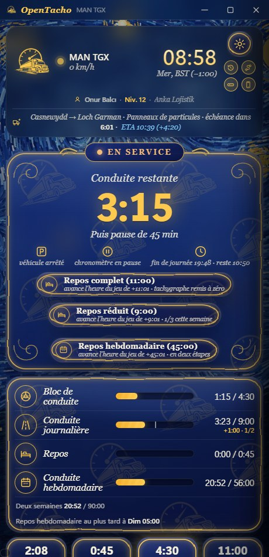
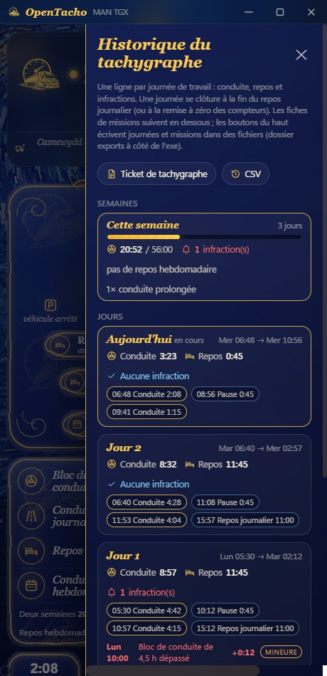
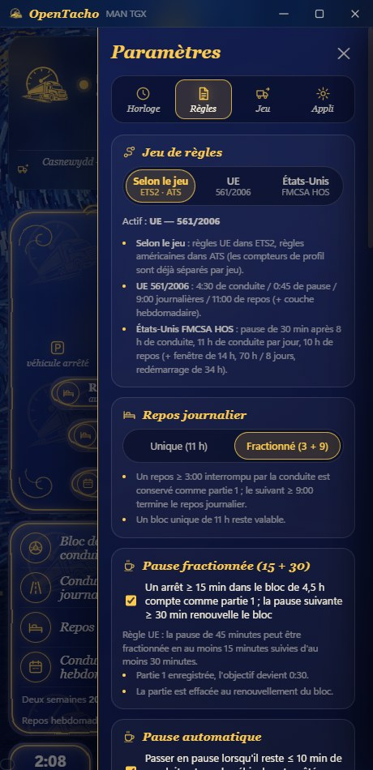
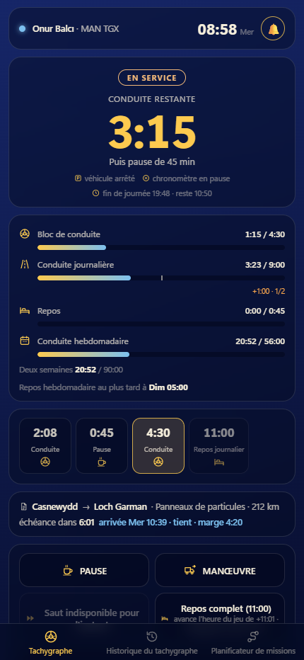

# OpenTacho

[English](README.md) · [Türkçe](README.tr.md) · [Deutsch](README.de.md) · [Русский](README.ru.md) · [Polski](README.pl.md) · [Português (Brasil)](README.pt-BR.md) · [Español](README.es.md) · **Français** · [Italiano](README.it.md) · [Čeština](README.cs.md)

Un petit tachygraphe de temps de conduite, sans fioritures, pour **Euro Truck Simulator 2** et
**American Truck Simulator** — une règle, pas de chichis, mesurée entièrement en **temps de jeu** :

> **4:30 de conduite → 0:45 de pause → 4:30 de conduite → 11:00 de repos journalier** (ou fractionné en **3:00 + 9:00**)

Il lit en direct l'horloge du jeu, la vitesse, le camion et les données de mission, affiche ce qu'il vous reste
et gère les cas délicats (ferries, sommeil, fuseaux horaires, sauvegardes rechargées, chargement de la remorque) pour que vous n'ayez qu'à conduire.

**Windows 10/11 uniquement** — le plugin de télémétrie partage les données via la mémoire partagée de Windows et l'appli utilise des API Windows pour le raccourci, les sons et la commande console. Linux (ETS2 natif / Proton) et macOS ne sont pas pris en charge.

<p align="center">
  
  
  
</p>
<p align="center">
  
</p>
<p align="center">
  
</p>

## Démarrage rapide

1. Téléchargez **[OpenTacho-win64.zip](https://github.com/onurbalcii/OpenTacho/releases/latest/download/OpenTacho-win64.zip)**
   (toutes les versions : [Releases](https://github.com/onurbalcii/OpenTacho/releases)) et extrayez-le où vous voulez.
2. Copiez **`plugin\scs-telemetry.dll`** dans le dossier des plugins du jeu
   (`…\Euro Truck Simulator 2\bin\win_x64\plugins\` — créez `plugins` s'il n'existe pas ;
   idem pour ATS). Lancez le jeu une fois et acceptez l'invite du SDK.
3. Lancez **`OpenTacho.exe`**. C'est tout — le reste est dans la boîte. Le premier démarrage demande
   votre langue et propose une courte visite guidée.

Pour le bouton ⏩ Sauter, activez la console développeur du jeu : dans
`Documents\Euro Truck Simulator 2\config.cfg`, mettez `g_console "1"` et `g_developer "1"`.
Le bouton reste verrouillé tant que les deux ne sont pas actifs.

Si la fenêtre ne s'ouvre pas du tout, installez le
[WebView2 Runtime](https://developer.microsoft.com/microsoft-edge/webview2/) gratuit de Microsoft — il fait déjà partie de
Windows 11 et de tout Windows 10 à jour, c'est donc rarement nécessaire.

## Réglage recommandé — important

Pour tirer le meilleur d'OpenTacho, mettez hors jeu la mécanique de fatigue du jeu et sautez les repos
depuis l'appli :

1. **Désactivez la simulation de fatigue du jeu** — ETS2/ATS : *Options → Gameplay → Simulation de la fatigue*
   (décochez). L'horloge de fatigue du jeu n'a rien à voir avec la règle UE : activée, elle peut vous forcer à dormir
   alors que le tachygraphe affiche encore du temps de conduite — ou vous laisser rouler quand le tachygraphe dit stop.
2. **N'utilisez pas le sommeil du jeu** (aires de repos, action « dormir » de l'hôtel). Ce sont des sauts de temps génériques que
   l'appli doit interpréter : elle les retient 30 s pour distinguer chargement et repos, et le jeu décide de la durée du
   sommeil — rarement les 11 h qu'exige un repos journalier, donc le repos reste incomplet.
3. **Sautez pauses et repos depuis l'appli** — temps de conduite écoulé, arrêtez le camion et appuyez sur
   ⏩ **Sauter** (pause de 45 min / repos de 11 h) ou **Repos complet**. L'appli avance l'horloge du jeu exactement du
   temps requis avec `g_set_time` et le crédite aussitôt aux compteurs, à la minute. Cela nécessite la
   console du jeu (`config.cfg` : `g_console "1"`, `g_developer "1"`).

Résultat : une seule chronologie cohérente — temps de conduite, pauses, repos journaliers et historique du tachygraphe
correspondent à ce que vous avez réellement fait.

## Fonctionnalités

- **En direct du jeu** – horloge, vitesse, modèle de camion, mission active (itinéraire, cargaison, délai de livraison).
- **Conduite / en service détectés d'après la vitesse** ; **Pause** et **Manœuvre** sont des boutons à un clic.
- **Pause automatique** quand le temps de conduite est presque écoulé et que le camion est arrêté depuis un moment.
- **Pause fractionnée (15 + 30)** : un arrêt ≥ 15 min dans le bloc de 4,5 h est conservé comme partie 1 ; une
  pause ultérieure ≥ 30 min renouvelle le bloc (règle UE). Désactivable.
- **Repos journalier fractionné (3 + 9)** avec un bandeau du déroulé de la journée qui montre chaque bloc terminé, le
  bloc en cours et le plan ; le repos unique de 11 h fonctionne toujours. Peut être verrouillé sur unique.
- **Planificateur de missions** : saisissez la distance et le délai de livraison de l'offre — l'appli simule pauses et repos journaliers/hebdomadaires avec
  vos droits actuels et donne le temps total, l'arrivée et la marge (**tient / ne tient pas**) ; mission acceptée, le temps d'itinéraire
  et la fenêtre de livraison viennent du jeu et le résultat s'affiche en direct sur la ligne de mission. La vitesse moyenne est apprise de l'odomètre ; une traversée **ferry/train**
  sur l'itinéraire est estimée d'après le temps d'itinéraire (comptée comme repos) et peut aussi être saisie à la main.
- **Profil de jeu** : le profil actif est reconnu (nom · niveau · entreprise dans la carte du haut) ; compteurs, historique et événements sont
  conservés **par profil** — changez de profil dans le jeu et l'appli change de compteurs (dossier `profiles\`).
- **Mode strict** (facultatif) : pauses et repos ne comptent que **moteur coupé + frein de stationnement serré** ; le panneau principal indique pourquoi rien ne compte.
- **Gravité des infractions** : chaque infraction est classée selon les catégories UE (mineure / grave / très grave) ; **amendes virtuelles** facultatives (€, approximatives) ; un bouton **Payer** les répercute dans le jeu — une copie de votre sauvegarde la plus récente, amende déduite du compte bancaire, est écrite dans un nouvel emplacement nommé « OpenTacho: amende payée », à charger depuis le menu Charger du jeu.
- **Annonces vocales** : de courtes phrases avec la voix hors ligne de Windows (« il reste 15 minutes de temps de conduite », « pause terminée »…), dans toutes les langues de l'appli ; curseurs de volume séparés pour le son d'alerte et la voix.
- **Règles hebdomadaires** (facultatif, Paramètres → Règles ; mode simple par défaut) : conduite hebdomadaire **56 h** / sur deux semaines **90 h**
  (semaine calendaire du jeu), conduite journalière prolongée à **10 h** deux fois par semaine, repos journalier réduit à **9 h** trois
  fois par semaine, **amplitude de la journée** (le repos doit commencer sous 13/15 h ; affichée comme « fin de journée » dans le panneau principal), **repos hebdomadaire**
  45 h / réduit 24 h (dû sous 6 jours ; un bouton le saute en deux étapes), cartes hebdomadaires dans l'historique, nouveaux types d'infractions.
- **Jeu de règles américain (FMCSA HOS)** pour American Truck Simulator, choisi automatiquement selon le jeu (Paramètres → Règles
  permet de forcer UE ou États-Unis) : **pause de 30 min après 8 h** de conduite, **11 h** de conduite par jour, **10 h** de repos ;
  la couche américaine facultative ajoute la **fenêtre de 14 heures** (la conduite cesse 14 h après la première conduite de la journée, les pauses ne
  la prolongent pas), le cycle **70 h / 8 jours** en service et le **redémarrage de 34 heures** (un bouton le saute). Barres, planificateur,
  historique, tickets et textes vocaux suivent le jeu de règles actif. Le fractionnement en couchette (7/3) n'est pas modélisé.
- **Sauts de temps gérés** : sommeil / ferry / train comptent comme repos ; **le chargement et le déchargement de la remorque
  non** ; charger une sauvegarde ramène les compteurs à cet instant.
- **Mode sans mission** : pas de livraison active → rien ne compte (le repos peut continuer à compter si vous le souhaitez). Définir un
  itinéraire GPS lance un comptage provisoire, annulé si vous ne prenez jamais la mission.
- **Manœuvre automatique** : s'active au début d'une mission et près de la zone de livraison, se désactive au-dessus de
  40 km/h.
- **Fuseaux horaires locaux** : le HUD affiche l'heure locale du pays ; l'appli lit le fuseau dans la
  sauvegarde la plus récente pour que les deux horloges concordent.
- **⏩ Sauter** : envoie `g_set_time` à la console du jeu pour avancer une pause ou un repos. Camion
  arrêté, un bouton **Repos complet** apparaît aussi : il saute d'un coup tout le repos journalier de 11 h (commencez une nouvelle mission avec des compteurs à zéro).
- **Historique du tachygraphe** : une liste ouverte depuis le bouton sous l'engrenage — totaux de conduite et de repos par jour,
  segments (heure, durée) et infractions (bloc de 4,5 h / 9 h journalières dépassés, avec heure et dépassement), comme un ticket de tachygraphe réel.
  Le bouton voisin passe au mini-bandeau sans ouvrir les paramètres.
- **Fiches de missions et export** : chaque chargement est enregistré à partir des événements de télémétrie — itinéraire, cargaison, km, nombre de conduites / pauses /
  infractions, recette et retard de livraison, pénalité d'annulation, amendes du jeu. Listés en bas du panneau d'historique ;
  les boutons **Ticket de tachygraphe** (PDF soigné + txt, comme un ticket DTCO 24 h : chronologie de la journée, segments, infractions, missions) et **CSV** (jours + missions) écrivent tout
  dans le dossier `exports` à côté de l'exe.
- **Alertes sonores** : une courte notification 15 min avant la fin de la conduite/du repos, deux fois en cas
  d'infraction, une fois à la fin d'une pause/d'un repos (peut être coupée ; remplacez les fichiers `.wav` pour la changer).
- **Mini-bandeau** : un raccourci global (par défaut `Ctrl + Num 0`, modifiable) remplace la fenêtre par une
  petite jauge toujours au premier plan au-dessus du jeu — icône d'état, temps restant, prochaine étape, mini-barres (bloc · journalier ·
  repos · hebdo/cycle), horloge du jeu, indicateurs, échéance de livraison avec le verdict du planificateur et boutons Pause / Manœuvre /
  Sauter / Repos complet / Repos hebdomadaire — déplacez-le où vous voulez ; opacité et taille (70–160 %) réglables.
- **Thèmes** : Van Gogh (par défaut, un fond peint par algorithme façon *Nuit étoilée* avec des
  panneaux vitrés), sombre simple, clair simple et **Personnalisé** : votre propre image de fond (JPG/PNG/WebP) plus un
  sélecteur de couleurs sur canevas pour les couleurs de fenêtre et d'accent (RGB/HEX ; la couleur du texte est choisie automatiquement, le mini-bandeau
  suit les mêmes couleurs). Disposition de l'image : remplir, ajuster, centrer, mosaïque ou étirer ; le thème personnalisé reprend l'aspect plat du thème simple.
- **Langues** : anglais, turc, allemand, russe, polonais, portugais du Brésil, espagnol, français, italien,
  tchèque — en ajouter une, c'est un seul fichier JSON.
- **Second écran sur téléphone ou tablette** (Paramètres → Appli → *Utiliser sur téléphone ou tablette*, ou le bouton téléphone sous
  l'engrenage) : activez le partage sur le réseau local et scannez le QR code — un appareil sur le même Wi-Fi affiche le tachygraphe dans son
  navigateur, sans appli : état, temps restant, barres, déroulé de la journée, mission avec ETA, indicateurs, événements, plus les onglets historique et planificateur.
  Pause / Manœuvre / Sauter / Repos complet fonctionnent depuis le téléphone (désactivable) ; la page garde l'écran allumé
  et sonne/vibre aux alertes. Le lien porte une clé aléatoire, rien n'est exposé sur internet et rien
  n'écoute quand le partage est coupé. Le pare-feu Windows demande une fois — autorisez pour les réseaux privés.
- **Vérification des mises à jour** : au démarrage, l'appli interroge GitHub sur la dernière version (désactivable) et affiche un
  bandeau avec un bouton de téléchargement quand une version plus récente existe ; Paramètres → Appli montre la version, une vérification manuelle
  et le lien de téléchargement.
- **Premier lancement** : un sélecteur de langue, puis une courte visite guidée de l'écran et des onglets de paramètres
  (relancez-la à tout moment depuis Paramètres → Appli).
- Mémorise la position/taille de la fenêtre, l'option toujours au premier plan, le journal d'événements, bouton de retour.

## Comment il compte

| Situation | Ce qui se passe |
|---|---|
| En mouvement > 5 km/h | Conduite. Les arrêts de moins de ~2 minutes de jeu (feux) restent de la conduite. |
| Arrêté | En service – chronomètre de conduite en pause, le repos ne compte pas. |
| Bouton **Pause** | Le repos compte ; se termine automatiquement quand le camion bouge. |
| **Manœuvre** | Le mouvement n'est pas compté comme conduite ; le repos est suspendu, pas perdu. |
| Saut de temps (sommeil, ferry, train) | Compté comme repos. Ferry/train et le saut de l'appli sont crédités aussitôt ; les autres sauts attendent jusqu'à 30 s au cas où un événement de mission les marque comme chargement. |
| Saut de temps au chargement/déchargement | Ignoré (détecté via l'indicateur de cargaison chargée / les événements de mission). |
| Arrêt de 15–44 min interrompu par la conduite | Conservé comme partie 1 de la pause ; une pause de 30 min plus tard renouvelle le bloc de 4,5 h. |
| Repos ≥ 3:00 interrompu par la conduite | Conservé comme partie 1 d'un repos fractionné ; 9:00 plus tard terminent la journée. |
| L'heure du jeu recule | Sauvegarde rechargée → compteurs restaurés depuis l'historique à la minute. |
| Pas de mission active ni d'itinéraire GPS | Sans mission : rien n'avance. |
| Règles hebdomadaires actives | Conduite restante = le plus petit des droits bloc / journalier / hebdomadaire / bimensuel ; échéances de fin de journée et de repos hebdomadaire dans le panneau principal ; un repos ≥ 24 h compte comme réduit, ≥ 45 h comme repos hebdomadaire complet. |

Tout est stocké dans `state.json` / `history.json` à côté d'`OpenTacho.exe` ; supprimez-les pour
repartir de zéro (ou utilisez *Remettre les compteurs à zéro* dans les paramètres).

## FAQ

**Existe-t-il un tachygraphe / suivi de temps de conduite pour Euro Truck Simulator 2 ou American Truck Simulator ?**
Oui — c'est exactement ce qu'est OpenTacho. Il compte temps de conduite, pauses et repos journalier en temps
de jeu et lit le jeu en direct via le plugin de télémétrie scs-sdk-plugin.

**Quelle règle suit-il ?**
Deux jeux de règles, choisis selon le jeu ou manuellement (Paramètres → Règles) : la règle UE (561/2006) — 4:30 de conduite →
pause de 45 minutes → 4:30 de conduite → 11 heures de repos journalier, la pause fractionnée 15 + 30, le repos journalier fractionné 3 + 9 et une
couche hebdomadaire facultative (56/90 h, prolongation à 10 h, repos réduit de 9 h, amplitude de la journée, repos hebdomadaire) — et la règle FMCSA
américaine pour American Truck Simulator (8 h / 30 min / 11 h / 10 h, fenêtre de 14 h facultative, 70 h / 8 jours,
redémarrage de 34 h).

**A-t-il besoin d'internet ou d'un compte ?**
Pas de compte, et tout se compte localement et hors ligne ; rien n'est envoyé. Les seules requêtes sortantes sont la
vérification des mises à jour facultative (lit les infos de la dernière version sur GitHub, désactivable) et le bouton de retour,
qui ouvre un formulaire web dans le navigateur. Le second écran téléphone/tablette reste dans votre réseau local.

**Fonctionne-t-il avec des mods de carte, ProMods ou ATS ?**
Oui. Il ne lit que la télémétrie (horloge, vitesse, mission), donc les mods de carte et de camion n'ont pas d'importance, et
American Truck Simulator utilise le même plugin — dans ATS les règles FMCSA américaines (8 h / 30 min / 11 h / 10 h,
fenêtre de 14 h, 70 h / 8 jours) s'appliquent automatiquement ; Paramètres → Règles peut forcer l'un ou l'autre jeu de règles.

**Le téléphone n'ouvre pas la page / le QR code ne fonctionne pas.**
Les deux appareils doivent être sur le même réseau local (même box ou partage de connexion du téléphone) ; les réseaux invités avec
« isolation AP » bloquent cela. Autorisez OpenTacho dans le pare-feu Windows pour les réseaux privés (il le demande à la première utilisation) et,
si l'adresse montre le mauvais réseau, choisissez-en une autre sous *Adresse réseau*. *Nouveau code* invalide les anciens liens.

**Le mini-bandeau n'apparaît pas au-dessus du jeu.**
Windows ne peut rien dessiner au-dessus d'un jeu en *plein écran exclusif*. Mettez le mode d'affichage du jeu
en *fenêtré* ou *plein écran sans bordure* (ETS2 : Options → Graphismes → Plein écran désactivé) et le
bandeau apparaît au-dessus, le jeu restant visible à travers son fond translucide.

**Les limites hebdomadaires 56 / 90 h sont-elles incluses ?**
Oui, en option : Paramètres → Règles → *Appliquer les règles hebdomadaires*. Le mode simple (4:30 / 45 / 11 seulement) est le défaut ; l'activer
ajoute la conduite hebdomadaire et bimensuelle, la prolongation à 10 h, le repos réduit de 9 h, l'amplitude de la journée et le repos hebdomadaire de 45 h.

**Dois-je laisser la simulation de fatigue du jeu activée ?**
Non. Désactivez-la (*Options → Gameplay*) et sautez pauses et repos avec les boutons ⏩ Sauter / Repos complet de l'appli
plutôt que de dormir dans le jeu — voir *Réglage recommandé* plus haut. L'horloge de fatigue du jeu ne suit pas la
règle UE, et le sommeil du jeu dure rarement les 11 h qu'exige un repos journalier.

**En quoi diffère-t-il des applis type ELD / temps de conduite ?**
C'est une alternative légère et open source (MIT) : jeux de règles UE et américain, pas de compte, fonctionne hors ligne,
un seul dossier portable avec un `.exe`, et il gère pour vous ferries, sommeil, fuseaux horaires et sauvegardes
rechargées.

## Arborescence

```
OpenTacho.exe          l'appli (build de release)          OpenTacho.py   la même appli, lancée depuis les sources
plugin/                scs-telemetry.dll → à copier dans le dossier plugins du jeu
app/                   contenu de la fenêtre : main.html, mini.html, mobile.html, assets/ (logo, fond, sons)
lang/                  en, tr, de, ru, pl, pt-BR, es, fr, it, cs — un fichier JSON par langue
lib/                   SII_Decrypt.dll (fonction fuseau horaire)
docs/screenshots/      les images utilisées dans ces READMEs
third_party/           licences des composants inclus
tools/                 build.bat (PyInstaller), générateurs d'assets
```

## Lancer / compiler depuis les sources

```powershell
git clone https://github.com/onurbalcii/OpenTacho.git
cd OpenTacho
pip install -r requirements.txt
python OpenTacho.py
```

`pip install pyinstaller` puis `tools\build.bat` produisent `dist\OpenTacho\OpenTacho.exe` et
`dist\OpenTacho-win64.zip` (le paquet de release). Nécessite Windows 10/11 avec WebView2 (fourni
avec Windows).

## Ajouter une langue

Copiez `lang/en.json` vers `lang/<code>.json`, traduisez les valeurs (gardez les `{placeholders}`
et les balises `<b>`/`<code>`), renseignez `"_name"`. La nouvelle langue apparaît automatiquement dans Paramètres → Appli et dans
le sélecteur de langue du premier lancement.

## Composants tiers et licences

Voir [`third_party/README.md`](third_party/README.md). OpenTacho est sous licence MIT
([LICENSE](LICENSE)). C'est un outil de fans, sans affiliation avec SCS Software.
