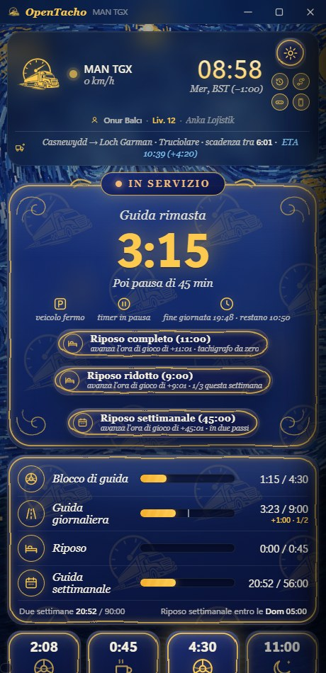
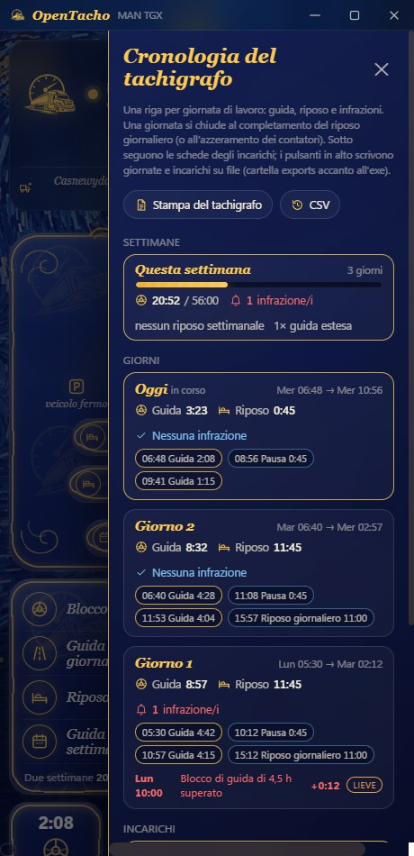
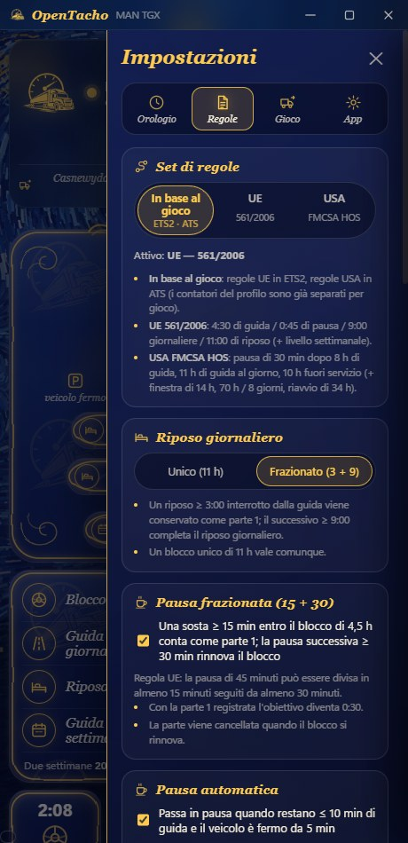
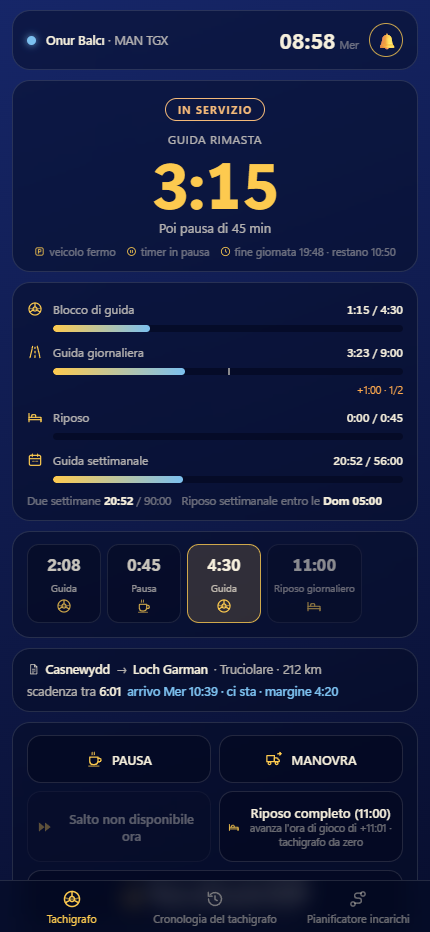

# OpenTacho

[English](README.md) · [Türkçe](README.tr.md) · [Deutsch](README.de.md) · [Русский](README.ru.md) · [Polski](README.pl.md) · [Português (Brasil)](README.pt-BR.md) · [Español](README.es.md) · [Français](README.fr.md) · **Italiano** · [Čeština](README.cs.md)

Un tachigrafo dei tempi di guida piccolo e senza fronzoli per **Euro Truck Simulator 2** e
**American Truck Simulator** — una regola, niente complicazioni, misurata interamente in **tempo di gioco**:

> **4:30 di guida → 0:45 di pausa → 4:30 di guida → 11:00 di riposo giornaliero** (oppure frazionato in **3:00 + 9:00**)

Legge in tempo reale orologio di gioco, velocità, camion e dati dell'incarico, mostra quanto ti resta
e gestisce i casi scomodi (traghetti, sonno, fusi orari, salvataggi ricaricati, carico del rimorchio) così tu devi solo guidare.

**Solo Windows 10/11** — il plugin di telemetria condivide i dati tramite la memoria condivisa di Windows e l'app usa API di Windows per il tasto rapido, i suoni e il comando console. Linux (ETS2 nativo / Proton) e macOS non sono supportati.

<p align="center">
  
  
  
</p>
<p align="center">
  
</p>
<p align="center">
  
</p>

## Avvio rapido

1. Scarica **[OpenTacho-win64.zip](https://github.com/onurbalcii/OpenTacho/releases/latest/download/OpenTacho-win64.zip)**
   (tutte le versioni: [Releases](https://github.com/onurbalcii/OpenTacho/releases)) ed estrailo dove vuoi.
2. Copia **`plugin\scs-telemetry.dll`** nella cartella dei plugin del gioco
   (`…\Euro Truck Simulator 2\bin\win_x64\plugins\` — crea `plugins` se non esiste;
   lo stesso per ATS). Avvia il gioco una volta e accetta l'avviso dell'SDK.
3. Esegui **`OpenTacho.exe`**. Tutto qui — il resto è già incluso. Al primo avvio ti chiede
   la lingua e propone un breve tour guidato.

Per il pulsante ⏩ Salta, attiva la console sviluppatore nel gioco: in
`Documents\Euro Truck Simulator 2\config.cfg` imposta `g_console "1"` e `g_developer "1"`.
Il pulsante resta bloccato finché entrambi non sono attivi.

Se la finestra non si apre affatto, installa il
[WebView2 Runtime](https://developer.microsoft.com/microsoft-edge/webview2/) gratuito di Microsoft — fa già parte di
Windows 11 e di qualsiasi Windows 10 aggiornato, quindi serve raramente.

## Configurazione consigliata — importante

Per sfruttare al meglio OpenTacho, togli di mezzo la meccanica della fatica del gioco e salta i riposi
dall'app:

1. **Disattiva la simulazione della fatica del gioco** — ETS2/ATS: *Opzioni → Gameplay → Simulazione della fatica*
   (deseleziona). L'orologio della fatica del gioco non ha nulla a che fare con la regola UE: se attivo può costringerti a dormire
   mentre il tachigrafo mostra ancora tempo di guida — o lasciarti proseguire quando il tachigrafo dice di fermarti.
2. **Non usare il sonno del gioco** (aree di sosta, l'azione "dormi" dell'hotel). Sono salti temporali generici che
   l'app deve interpretare: li trattiene 30 s per distinguere carico da riposo, e il gioco decide quanto
   hai dormito — quasi mai le 11 h che un riposo giornaliero richiede, quindi il riposo resta incompleto.
3. **Salta pause e riposi dall'app** — esaurito il tempo di guida, ferma il camion e premi
   ⏩ **Salta** (pausa di 45 min / riposo di 11 h) o **Riposo completo**. L'app fa avanzare l'orologio di gioco esattamente del
   tempo richiesto con `g_set_time` e lo accredita subito ai contatori, al minuto. Serve la
   console del gioco (`config.cfg`: `g_console "1"`, `g_developer "1"`).

Risultato: un'unica linea temporale coerente — tempo di guida, pause, riposi giornalieri e cronologia del tachigrafo
corrispondono a ciò che hai davvero fatto.

## Funzionalità

- **In diretta dal gioco** – orologio, velocità, modello del camion, incarico attivo (percorso, carico, tempo per consegnare).
- **Guida / in servizio rilevati dalla velocità**; **Pausa** e **Manovra** sono pulsanti a un tocco.
- **Pausa automatica** quando il tempo di guida è quasi finito e il camion è fermo da un po'.
- **Pausa frazionata (15 + 30)**: una sosta ≥ 15 min entro il blocco di 4,5 h viene conservata come parte 1; una
  pausa successiva ≥ 30 min rinnova il blocco (regola UE). Disattivabile.
- **Riposo giornaliero frazionato (3 + 9)** con una striscia del flusso della giornata che mostra ogni blocco completato, quello
  in corso e il piano; il riposo unico di 11 h funziona comunque. Può essere bloccato su unico.
- **Pianificatore incarichi**: inserisci distanza e tempo di consegna dell'offerta — l'app simula pause e riposi giornalieri/settimanali con
  i tuoi bonus attuali e dà tempo totale, arrivo e margine (**ci sta / non ci sta**); con un incarico accettato, tempo di percorso
  e finestra di consegna arrivano dal gioco e il risultato compare in diretta nella riga dell'incarico. La velocità media si apprende dal contachilometri; una traversata **traghetto/treno**
  sul percorso viene stimata dal tempo di percorso (contata come riposo) e può anche essere inserita a mano.
- **Profilo di gioco**: il profilo attivo viene riconosciuto (nome · livello · azienda nella scheda in alto); contatori, cronologia ed eventi sono
  tenuti **per profilo** — cambia profilo nel gioco e l'app cambia contatori (cartella `profiles\`).
- **Modalità rigorosa** (opzionale): pause e riposi contano solo a **motore spento + freno di stazionamento inserito**; il pannello principale mostra perché non conta nulla.
- **Gravità delle infrazioni**: ogni infrazione è classificata secondo le classi UE (lieve / grave / molto grave); **multe virtuali** opzionali (€, approssimative); un pulsante **Paga** le riflette nel gioco — una copia del tuo salvataggio più recente con la multa detratta dal conto bancario viene scritta in un nuovo slot chiamato "OpenTacho: multa pagata", da caricare dal menu Carica del gioco.
- **Annunci vocali**: brevi frasi con la voce offline di Windows ("restano 15 minuti di tempo di guida", "pausa completata"…), in tutte le lingue dell'app; cursori del volume separati per il suono di avviso e la voce.
- **Regole settimanali** (opzionale, Impostazioni → Regole; modalità semplice di default): guida settimanale **56 h** / bisettimanale **90 h**
  (settimana di calendario del gioco), guida giornaliera estesa a **10 h** due volte a settimana, riposo giornaliero ridotto a **9 h** tre
  volte a settimana, **ampiezza della giornata** (il riposo deve iniziare entro 13/15 h; mostrata come "fine giornata" nel pannello principale), **riposo settimanale**
  45 h / ridotto 24 h (entro 6 giorni; un pulsante lo salta in due passi), schede settimanali nella cronologia, nuovi tipi di infrazione.
- **Set di regole USA (FMCSA HOS)** per American Truck Simulator, scelto automaticamente in base al gioco (Impostazioni → Regole
  permette di forzare UE o USA): **pausa di 30 min dopo 8 h** di guida, **11 h** di guida al giorno, **10 h** fuori servizio;
  il livello USA opzionale aggiunge la **finestra di 14 ore** (la guida termina 14 h dopo la prima guida della giornata, le pause non
  la estendono), il ciclo **70 h / 8 giorni** in servizio e il **riavvio di 34 ore** (un pulsante lo salta). Barre, pianificatore,
  cronologia, stampe e testi vocali seguono il set attivo. Il frazionamento in cuccetta (7/3) non è modellato.
- **Salti temporali gestiti**: sonno / traghetto / treno contano come riposo; **carico e scarico del rimorchio
  no**; caricare un salvataggio riporta i contatori a quel momento.
- **Modalità senza incarico**: nessuna consegna attiva → nulla conta (il riposo opzionalmente sì). Impostare un
  percorso GPS avvia un conteggio provvisorio, annullato se non accetti mai l'incarico.
- **Manovra automatica**: si attiva all'inizio di un incarico e vicino all'area di consegna, si disattiva oltre
  40 km/h.
- **Fusi orari locali**: l'HUD mostra l'ora locale del paese; l'app legge il fuso dal
  salvataggio più recente così i due orologi coincidono.
- **⏩ Salta**: invia `g_set_time` alla console del gioco per far avanzare una pausa o un riposo. Con il camion
  fermo compare anche un pulsante **Riposo completo**: salta in un colpo l'intero riposo giornaliero di 11 h (inizia un nuovo incarico con i contatori a zero).
- **Cronologia del tachigrafo**: un elenco aperto dal pulsante sotto l'ingranaggio — totali di guida e riposo per giorno,
  segmenti (ora, durata) e infrazioni (blocco di 4,5 h / 9 h giornaliere superati, con ora ed eccedenza), come una stampa di un vero tachigrafo.
  Il pulsante accanto passa alla mini barra senza aprire le impostazioni.
- **Registri degli incarichi ed esportazione**: ogni carico viene registrato dagli eventi di telemetria — percorso, carico, km, conteggi di guida / pause /
  infrazioni, ricavo e ritardo della consegna, penale di annullamento, multe di gioco. Elencati in fondo al pannello della cronologia;
  i pulsanti **Stampa del tachigrafo** (PDF curato + txt, come una stampa DTCO da 24 h: linea temporale del giorno, segmenti, infrazioni, incarichi) e **CSV** (giorni + incarichi) scrivono tutto
  nella cartella `exports` accanto all'exe.
- **Avvisi sonori**: una breve notifica 15 min prima della fine di guida/riposo, due volte a
  un'infrazione, una volta al termine di una pausa/riposo (silenziabile; sostituisci i file `.wav` per cambiarla).
- **Mini barra**: un tasto rapido globale (di default `Ctrl + Num 0`, modificabile) sostituisce la finestra con un
  piccolo indicatore sempre in primo piano sopra il gioco — icona di stato, tempo rimasto, prossimo passo, mini barre (blocco · giornaliera ·
  riposo · settimanale/ciclo), orologio di gioco, indicatori, scadenza della consegna con il verdetto del pianificatore e pulsanti Pausa / Manovra /
  Salta / Riposo completo / Riposo settimanale — trascinala dove vuoi; opacità e dimensione (70–160 %) regolabili.
- **Temi**: Van Gogh (di default, uno sfondo dipinto algoritmicamente in stile *Notte stellata* con
  pannelli di vetro), scuro semplice, chiaro semplice e **Personalizzato**: la tua immagine di sfondo (JPG/PNG/WebP) più un
  selettore colore su canvas per i colori di finestra e d'accento (RGB/HEX; il colore del testo si sceglie automaticamente, la mini barra
  segue gli stessi colori). Posizione dell'immagine: riempi, adatta, centra, affianca o estendi; il tema personalizzato usa l'aspetto piatto del tema semplice.
- **Lingue**: inglese, turco, tedesco, russo, polacco, portoghese brasiliano, spagnolo, francese, italiano,
  ceco — aggiungerne una è un singolo file JSON.
- **Secondo schermo su telefono o tablet** (Impostazioni → App → *Usa su telefono o tablet*, o il pulsante telefono sotto
  l'ingranaggio): attiva la condivisione sulla rete locale e scansiona il codice QR — un dispositivo sullo stesso Wi-Fi mostra il tachigrafo nel
  browser, senza app: stato, tempo rimasto, barre, flusso della giornata, incarico con ETA, indicatori, eventi, più le schede cronologia e pianificatore.
  Pausa / Manovra / Salta / Riposo completo funzionano dal telefono (disattivabile); la pagina tiene lo schermo acceso
  e suona/vibra agli avvisi. Il link contiene una chiave casuale, nulla è esposto a internet e nulla
  resta in ascolto a condivisione spenta o ad app chiusa; a ogni riavvio la condivisione è spenta e ogni accensione
  genera un nuovo codice. Il firewall di Windows chiede una volta — consentilo per le reti private.
- **Controllo aggiornamenti**: all'avvio l'app chiede a GitHub l'ultima versione (disattivabile) e mostra un
  banner con pulsante di download quando esiste una versione più recente; Impostazioni → App mostra la versione, un controllo manuale
  e il link di download.
- **Primo avvio**: un selettore di lingua e poi un breve tour guidato della schermata e delle schede delle impostazioni
  (riavvialo quando vuoi da Impostazioni → App).
- Ricorda posizione/dimensioni della finestra, opzione sempre in primo piano, registro eventi, pulsante feedback.

## Come conta

| Situazione | Cosa succede |
|---|---|
| In movimento > 5 km/h | Guida. Le soste inferiori a ~2 minuti di gioco (semafori) restano guida. |
| Fermo | In servizio – timer di guida in pausa, il riposo non conta. |
| Pulsante **Pausa** | Il riposo conta; termina da solo quando il camion si muove. |
| **Manovra** | Il movimento non conta come guida; il riposo è sospeso, non scartato. |
| Salto temporale (sonno, traghetto, treno) | Contato come riposo. Traghetto/treno e il salto dell'app sono accreditati subito; gli altri salti attendono fino a 30 s nel caso un evento dell'incarico li marchi come carico. |
| Salto temporale al carico/scarico | Ignorato (rilevato tramite il flag di carico / gli eventi dell'incarico). |
| Sosta di 15–44 min interrotta dalla guida | Conservata come parte 1 della pausa; una pausa di 30 min successiva rinnova il blocco di 4,5 h. |
| Riposo ≥ 3:00 interrotto dalla guida | Conservato come parte 1 di un riposo frazionato; 9:00 dopo completano la giornata. |
| L'ora di gioco torna indietro | Salvataggio ricaricato → contatori ripristinati dalla cronologia al minuto. |
| Nessun incarico attivo e nessun percorso GPS | Senza incarico: nulla avanza. |
| Regole settimanali attive | Guida rimasta = il minore tra i bonus blocco / giornaliero / settimanale / bisettimanale; scadenze di fine giornata e riposo settimanale nel pannello principale; un riposo ≥ 24 h conta come ridotto, ≥ 45 h come riposo settimanale completo. |

Tutto è salvato in `state.json` / `history.json` accanto a `OpenTacho.exe`; cancellali per
ripartire da zero (o usa *Azzera contatori* nelle impostazioni).

## FAQ

**Esiste un tachigrafo / tracker dei tempi di guida per Euro Truck Simulator 2 o American Truck Simulator?**
Sì — OpenTacho è esattamente questo. Conta tempo di guida, pause e riposo giornaliero in tempo
di gioco e legge il gioco in diretta tramite il plugin di telemetria scs-sdk-plugin.

**Quale regola segue?**
Due set di regole, scelti in base al gioco o a mano (Impostazioni → Regole): la regola UE (561/2006) — 4:30 di guida →
pausa di 45 minuti → 4:30 di guida → 11 ore di riposo giornaliero, la pausa frazionata 15 + 30, il riposo giornaliero frazionato 3 + 9 e un
livello settimanale opzionale (56/90 h, estensione a 10 h, riposo ridotto di 9 h, ampiezza della giornata, riposo settimanale) — e la regola FMCSA
statunitense per American Truck Simulator (8 h / 30 min / 11 h / 10 h, finestra di 14 h opzionale, 70 h / 8 giorni,
riavvio di 34 h).

**Serve una connessione internet o un account?**
Nessun account, e tutto viene contato in locale e offline; nulla viene caricato. Le uniche richieste in uscita sono il
controllo aggiornamenti opzionale (legge le informazioni sull'ultima versione da GitHub, disattivabile) e il pulsante feedback,
che apre un modulo web nel browser. Il secondo schermo su telefono/tablet resta dentro la tua rete locale.

**Funziona con mod delle mappe, ProMods o ATS?**
Sì. Legge solo la telemetria (orologio, velocità, incarico), quindi mod di mappe e camion non contano, e
American Truck Simulator usa lo stesso plugin — in ATS le regole FMCSA USA (8 h / 30 min / 11 h / 10 h,
finestra di 14 h, 70 h / 8 giorni) si applicano automaticamente; Impostazioni → Regole può forzare l'uno o l'altro set.

**Il telefono non apre la pagina / il codice QR non funziona.**
Entrambi i dispositivi devono essere sulla stessa rete locale (stesso router o hotspot del telefono); le reti ospiti con
"isolamento AP" lo bloccano. Consenti OpenTacho nel firewall di Windows per le reti private (lo chiede al primo uso) e,
se l'indirizzo mostra la rete sbagliata, scegline un altro in *Indirizzo di rete*. *Nuovo codice* invalida i vecchi link.

**La mini barra non compare sopra il gioco.**
Windows non può disegnare nessun overlay sopra un gioco in *schermo intero esclusivo*. Imposta la modalità di visualizzazione
del gioco su *finestra* o *schermo intero senza bordi* (ETS2: Opzioni → Grafica → Schermo intero disattivato) e la
barra compare sopra, con il gioco visibile attraverso lo sfondo traslucido.

**I limiti settimanali di 56 / 90 h sono inclusi?**
Sì, in via opzionale: Impostazioni → Regole → *Applica le regole settimanali*. La modalità semplice (solo 4:30 / 45 / 11) è quella di default; attivandola
si aggiungono guida settimanale e bisettimanale, estensione a 10 h, riposo ridotto di 9 h, ampiezza della giornata e riposo settimanale di 45 h.

**Devo tenere attiva la simulazione della fatica del gioco?**
No. Disattivala (*Opzioni → Gameplay*) e salta pause e riposi con i pulsanti ⏩ Salta / Riposo completo dell'app
invece di dormire nel gioco — vedi *Configurazione consigliata* sopra. L'orologio della fatica del gioco non segue la
regola UE, e il sonno nel gioco raramente dura le 11 h che un riposo giornaliero richiede.

**In cosa differisce dalle app tipo ELD / tempi di guida?**
È un'alternativa leggera e open source (MIT): set di regole UE e USA, nessun account, funziona offline,
una singola cartella portatile con un `.exe`, e gestisce per te traghetti, sonno, fusi orari e salvataggi
ricaricati.

## Struttura delle cartelle

```
OpenTacho.exe          l'app (build di release)           OpenTacho.py   la stessa app, eseguita dai sorgenti
plugin/                scs-telemetry.dll → da copiare nella cartella plugins del gioco
app/                   contenuto della finestra: main.html, mini.html, mobile.html, assets/ (logo, sfondo, suoni)
lang/                  en, tr, de, ru, pl, pt-BR, es, fr, it, cs — un file JSON per lingua
lib/                   SII_Decrypt.dll (funzione fuso orario)
docs/screenshots/      le immagini usate in questi README
third_party/           licenze dei componenti inclusi
tools/                 build.bat (PyInstaller), generatori di asset
```

## Eseguire / compilare dai sorgenti

```powershell
git clone https://github.com/onurbalcii/OpenTacho.git
cd OpenTacho
pip install -r requirements.txt
python OpenTacho.py
```

`pip install pyinstaller` e `tools\build.bat` producono `dist\OpenTacho\OpenTacho.exe` e
`dist\OpenTacho-win64.zip` (il pacchetto di release). Richiede Windows 10/11 con WebView2 (incluso
in Windows).

## Aggiungere una lingua

Copia `lang/en.json` in `lang/<codice>.json`, traduci i valori (mantieni i `{placeholders}`
e i tag `<b>`/`<code>`), imposta `"_name"`. La nuova lingua compare automaticamente in Impostazioni → App e nel
selettore di lingua del primo avvio.

## Componenti di terze parti e licenze

Vedi [`third_party/README.md`](third_party/README.md). OpenTacho è rilasciato con licenza MIT
([LICENSE](LICENSE)). È uno strumento fatto da fan e non è affiliato a SCS Software.
