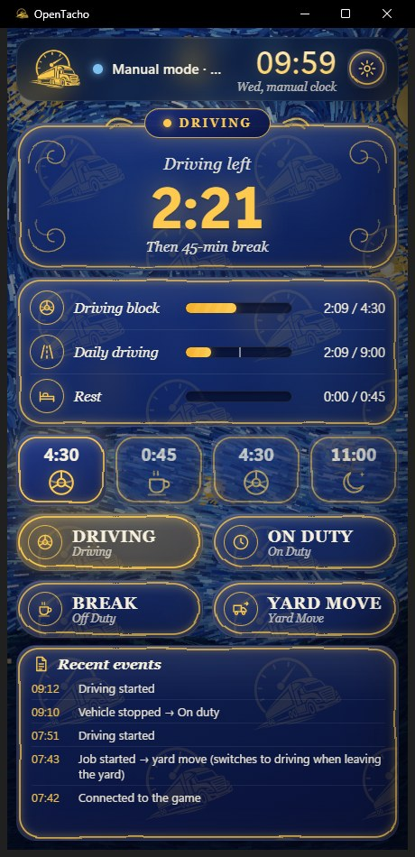
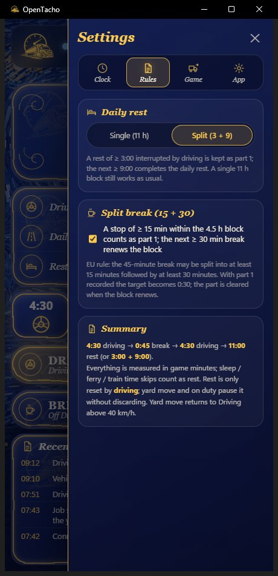

# OpenTacho

**English** · [Türkçe](README.tr.md) · [Deutsch](README.de.md) · [Русский](README.ru.md) · [Polski](README.pl.md)

A small, opinionated hours-of-service tachograph for **Euro Truck Simulator 2** and
**American Truck Simulator** — one rule, no fuss, measured entirely in **game time**:

> **4:30 driving → 0:45 break → 4:30 driving → 11:00 daily rest** (or a split **3:00 + 9:00**)

It reads the game clock, speed, truck and job data live from the game, shows what you have
left, and handles the awkward cases (ferries, sleeping, time zones, save reloads, trailer
loading) so you can just drive.

**Windows 10/11 only** — the telemetry plugin shares data through Windows shared memory and the app uses Windows APIs for the hotkey, sounds and the console command. Linux (native ETS2 / Proton) and macOS are not supported.

<p align="center">
  
  
</p>
<p align="center">
  
</p>

## Quick start (no Python needed)

1. Download **[OpenTacho-win64.zip](https://github.com/onurbalcii/OpenTacho/releases/latest/download/OpenTacho-win64.zip)**
   (all versions: [Releases](https://github.com/onurbalcii/OpenTacho/releases)) and extract it anywhere.
2. Copy **`plugin\scs-telemetry.dll`** into the game's plugin folder
   (`…\Euro Truck Simulator 2\bin\win_x64\plugins\` — create `plugins` if it does not exist;
   same for ATS). Start the game once and accept the SDK prompt.
3. Run **`OpenTacho.exe`**. That's it — everything else is in the box. The first start asks for
   your language and gives a short guided tour.

For the ⏩ skip button, enable the developer console in the game: in
`Documents\Euro Truck Simulator 2\config.cfg` set `g_console "1"` and `g_developer "1"`.
The button stays locked until both are on.

## Features

- **Live from the game** – clock, speed, truck model, active job (route, cargo, time to deliver).
- **Driving / on duty detected from speed**; **Break** and **Yard move** are one-tap buttons.
- **Automatic break** when driving time is almost up and the truck has been stopped a while.
- **Split break (15 + 30)**: a stop of ≥ 15 min inside the 4.5 h block is kept as part 1; a
  later ≥ 30 min break renews the block (EU rule). Can be turned off.
- **Split daily rest (3 + 9)** with a day-flow strip that shows every completed block, the
  current one and the plan; single 11 h rest still works as usual. Can be locked to single.
- **Time skips handled**: sleeping / ferry / train count as rest; **trailer loading and
  unloading do not**; loading a save rolls the counters back to that moment.
- **Off-job mode**: no active delivery → nothing counts (rest optionally still does). Setting a
  GPS route starts provisional counting that is reverted if you never take the job.
- **Yard move automation**: switches on when a job starts and near the delivery area, off above
  40 km/h.
- **Local time zones**: the HUD shows the country's local time; the app reads the zone from
  the newest save file so both clocks match.
- **⏩ Skip**: sends `g_set_time` to the game console to fast-forward a break or rest.
- **Sound alerts**: a short notification 15 min before driving/rest ends, twice at a
  violation, once when a break/rest completes (can be muted; swap the `.wav` files to change it).
- **Mini strip**: a global hotkey (default `Ctrl + Num 0`, changeable) swaps the window for a
  small always-on-top gauge over the game — status icon, time left, next step, three mini bars,
  game clock, flags, delivery due time and Break / Yard move / Skip buttons — drag it anywhere.
- **Themes**: Van Gogh (default, an algorithmically painted *Starry Night*-style backdrop with
  glass panels), simple dark, simple light.
- **Languages**: English, Turkish, German, Russian, Polish — adding one is a single JSON file.
- **First run**: a language picker, then a short guided tour of the screen and the settings tabs
  (restart it any time from Settings → App).
- Remembers window position/size, always-on-top option, event log, feedback button.

## How it counts

| Situation | What happens |
|---|---|
| Moving > 5 km/h | Driving. Stops shorter than ~2 game minutes (traffic lights) stay driving. |
| Stopped | On duty – driving timer paused, rest not counting. |
| **Break** button | Rest counts; ends automatically when the truck moves. |
| **Yard move** | Movement is not counted as driving; rest is paused, not discarded. |
| Time skip (sleep, ferry, train) | Counted as rest after a 4 s hold. |
| Time skip at loading/unloading | Ignored (detected via the cargo-loaded flag / job events). |
| Stop of 15–44 min interrupted by driving | Kept as break part 1; a later 30 min break renews the 4.5 h block. |
| Rest ≥ 3:00 interrupted by driving | Kept as part 1 of a split rest; 9:00 later completes the day. |
| Game time goes backwards | Save reload → counters restored from the per-minute history. |
| No active job and no GPS route | Off job: nothing advances. |

Everything is stored in `state.json` / `history.json` next to `OpenTacho.exe`; delete them to
start fresh (or use *Reset counters* in the settings).

## Folder layout

```
OpenTacho.exe          the app (release build)            OpenTacho.py   the same app, run from source
plugin/                scs-telemetry.dll → copy into the game's plugins folder
app/                   window content: main.html, mini.html, assets/ (logo, background, sounds)
lang/                  en, tr, de, ru, pl — one JSON file per language
lib/                   SII_Decrypt.dll (time-zone feature)
docs/screenshots/      the images used in these READMEs
third_party/           licenses of the bundled components
tools/                 build.bat (PyInstaller), asset generators
```

## Running / building from source

```powershell
git clone https://github.com/onurbalcii/OpenTacho.git
cd OpenTacho
pip install -r requirements.txt
python OpenTacho.py
```

`pip install pyinstaller` and `tools\build.bat` produce `dist\OpenTacho\OpenTacho.exe` and
`dist\OpenTacho-win64.zip` (the release package). Requires Windows 10/11 with WebView2 (ships
with Windows).

## Feedback

Settings → App → **Send feedback** opens a form in the app's language. Replace the links in
`FEEDBACK_URLS` at the top of `OpenTacho.py` with your own before publishing a fork.

## Adding a language

Copy `lang/en.json` to `lang/<code>.json`, translate the values (keep the `{placeholders}`
and the `<b>`/`<code>` tags), set `"_name"`. The new language appears in Settings → App and in
the first-run language picker automatically.

## Third-party components and licenses

See [`third_party/README.md`](third_party/README.md). OpenTacho is MIT licensed
([LICENSE](LICENSE)). It is a fan-made tool and is not affiliated with SCS Software.
