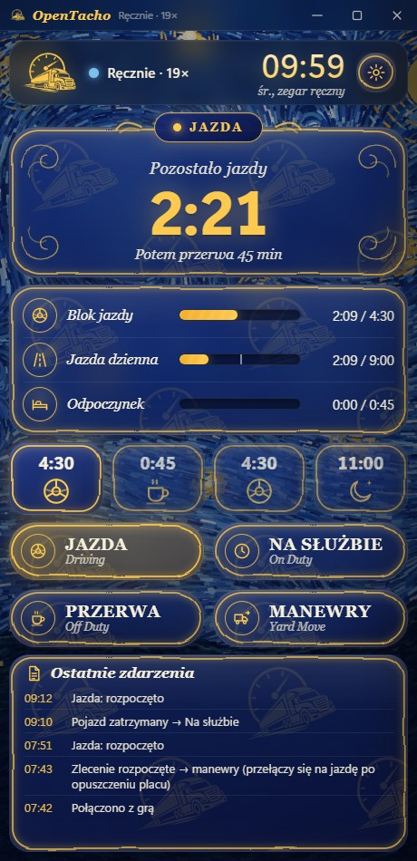
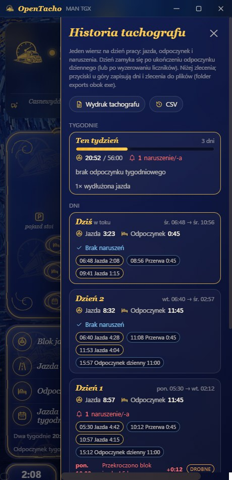
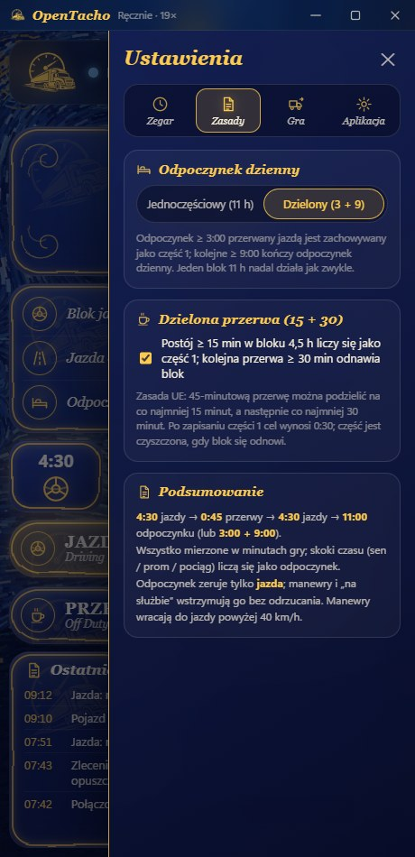

# OpenTacho

[English](README.md) · [Türkçe](README.tr.md) · [Deutsch](README.de.md) · [Русский](README.ru.md) · **Polski**

Mały, konsekwentny tachograf czasu pracy dla **Euro Truck Simulator 2** i
**American Truck Simulator** — jedna zasada, bez zamieszania, wszystko mierzone w **czasie gry**:

> **4:30 jazdy → 0:45 przerwy → 4:30 jazdy → 11:00 odpoczynku dziennego** (lub dzielony **3:00 + 9:00**)

Odczytuje zegar gry, prędkość, dane ciężarówki i zlecenia na żywo z gry, pokazuje, ile Ci
zostało, i ogarnia niewygodne przypadki (promy, sen, strefy czasowe, wczytywanie zapisów,
ładowanie naczepy), żebyś mógł po prostu jechać.

**Tylko Windows 10/11** — wtyczka telemetrii udostępnia dane przez pamięć współdzieloną Windows, a aplikacja używa Windows API do skrótu klawiszowego, dźwięków i polecenia konsoli. Linux (natywny ETS2 / Proton) i macOS nie są wspierane.

<p align="center">
  
  
  
</p>
<p align="center">
  
</p>

## Szybki start

1. Pobierz **[OpenTacho-win64.zip](https://github.com/onurbalcii/OpenTacho/releases/latest/download/OpenTacho-win64.zip)**
   (wszystkie wersje: [Releases](https://github.com/onurbalcii/OpenTacho/releases)) i rozpakuj gdziekolwiek.
2. Skopiuj **`plugin\scs-telemetry.dll`** do folderu wtyczek gry
   (`…\Euro Truck Simulator 2\bin\win_x64\plugins\` — utwórz `plugins`, jeśli nie istnieje;
   dla ATS tak samo). Uruchom grę raz i potwierdź monit SDK.
3. Uruchom **`OpenTacho.exe`**. To wszystko — reszta jest w pudełku. Przy pierwszym uruchomieniu
   wybierzesz język i przejdziesz krótki samouczek.

Dla przycisku ⏩ Pomiń włącz konsolę deweloperską w grze: w
`Documents\Euro Truck Simulator 2\config.cfg` ustaw `g_console "1"` i `g_developer "1"`.
Przycisk pozostaje zablokowany, dopóki oba nie są włączone.

Jeśli okno w ogóle się nie otwiera, zainstaluj darmowy
[WebView2 Runtime](https://developer.microsoft.com/microsoft-edge/webview2/) od Microsoftu — jest już częścią
Windows 11 i każdego aktualnego Windows 10, więc rzadko jest to potrzebne.

## Zalecany sposób użycia — ważne

Aby w pełni wykorzystać OpenTacho, wyłącz mechanikę zmęczenia gry i pomijaj odpoczynek przez aplikację:

1. **Wyłącz symulację zmęczenia w grze** — ETS2/ATS: *Opcje → Rozgrywka → Symulacja zmęczenia* (odznacz).
   Zegar zmęczenia gry nie ma nic wspólnego z regułą UE: pozostawiony włączony może zmusić cię do snu, gdy
   tachograf wciąż pokazuje czas jazdy — albo pozwolić jechać dalej, gdy tachograf mówi „stop”.
2. **Nie korzystaj ze snu w grze** (parkingi, „śpij” w hotelu). To zwykłe przeskoki czasu, które aplikacja musi
   dopiero zinterpretować: wstrzymuje je na 30 s, by odróżnić załadunek od odpoczynku, a o długości snu decyduje
   gra — często nie jest to 11 h potrzebnych na odpoczynek dzienny, więc odpoczynek pozostaje niepełny.
3. **Pomijaj przerwy i odpoczynki z aplikacji** — gdy czas jazdy się skończy, zatrzymaj ciężarówkę i naciśnij
   ⏩ **Pomiń** (przerwa 45 min / odpoczynek 11 h) lub **Pełny odpoczynek**. Aplikacja przesuwa zegar gry
   dokładnie o wymagany czas poleceniem `g_set_time` i natychmiast, co do minuty, zapisuje go w licznikach.
   Wymaga to włączonej konsoli gry (`config.cfg`: `g_console "1"`, `g_developer "1"`).

Efekt: jedna spójna oś czasu — jazda, przerwy, odpoczynki dzienne i historia tachografu dokładnie
odpowiadają temu, co naprawdę zrobiłeś.

## Funkcje

- **Na żywo z gry** – zegar, prędkość, model ciężarówki, aktywne zlecenie (trasa, ładunek, czas do dostawy).
- **Jazda / Na służbie wykrywane z prędkości**; **Przerwa** i **Manewry** to przyciski jednego dotknięcia.
- **Automatyczna przerwa**, gdy czas jazdy dobiega końca, a ciężarówka stoi od jakiegoś czasu.
- **Dzielona przerwa (15 + 30)**: postój ≥ 15 min w bloku 4,5 h jest zachowywany jako część 1;
  późniejsza przerwa ≥ 30 min odnawia blok (zasada UE). Można wyłączyć.
- **Dzielony odpoczynek dzienny (3 + 9)** z paskiem przebiegu dnia pokazującym każdy ukończony blok,
  bieżący i plan; jednoczęściowy odpoczynek 11 h nadal działa jak zwykle. Można zablokować na jednoczęściowy.
- **Obsługa skoków czasu**: sen / prom / pociąg liczą się jako odpoczynek; **ładowanie i rozładunek
  naczepy — nie**; wczytanie zapisu cofa liczniki do tej chwili.
- **Tryb bez zlecenia**: brak aktywnej dostawy → nic się nie liczy (odpoczynek opcjonalnie tak). Ustawienie
  trasy GPS rozpoczyna liczenie tymczasowe, cofane, jeśli nigdy nie przyjmiesz zlecenia.
- **Automatyka manewrów**: włącza się na początku zlecenia i w pobliżu strefy dostawy, wyłącza powyżej 40 km/h.
- **Lokalne strefy czasowe**: HUD pokazuje czas lokalny kraju; aplikacja odczytuje strefę z
  najnowszego zapisu, aby oba zegary się zgadzały.
- **⏩ Pomiń**: wysyła `g_set_time` do konsoli gry, aby przewinąć przerwę lub odpoczynek. Gdy ciężarówka stoi,
  pojawia się też przycisk **Pełny odpoczynek**: pomija cały 11-godzinny odpoczynek dzienny za jednym razem (nowe zlecenie z wyzerowanymi licznikami).
- **Historia tachografu**: lista otwierana przyciskiem pod kołem zębatym — jazda i odpoczynek dzień po dniu,
  odcinki (godzina, czas trwania) i naruszenia (przekroczony blok 4,5 h / 9 h dziennie, z godziną i wielkością przekroczenia), jak wydruk z prawdziwego tachografu.
  Przycisk obok przełącza na mini pasek bez otwierania ustawień.
- **Alerty dźwiękowe**: krótkie powiadomienie 15 min przed końcem jazdy/odpoczynku, dwa razy przy naruszeniu,
  raz po ukończeniu przerwy/odpoczynku (można wyciszyć; zamień pliki `.wav`, aby zmienić dźwięk).
- **Mini pasek**: globalny skrót (domyślnie `Ctrl + Num 0`, do zmiany) zamienia okno na mały,
  zawsze widoczny wskaźnik nad grą — ikona statusu, pozostały czas, następny krok, trzy mini paski,
  zegar gry, znaczniki, termin dostawy oraz przyciski Przerwa / Manewry / Pomiń — przeciągaj gdziekolwiek.
- **Motywy**: Van Gogh (domyślny, algorytmicznie namalowane tło w stylu *Gwiaździstej nocy*
  ze szklanymi panelami), prosty ciemny, prosty jasny i **Własny**: własny obraz tła (JPG/PNG/WebP) plus
  próbnik kolorów na canvasie dla koloru okna i akcentu (RGB/HEX; kolor tekstu dobierany automatycznie, mini pasek używa tych samych kolorów).
- **Języki**: polski, angielski, turecki, niemiecki, rosyjski — nowy język to jeden plik JSON.
- **Pierwsze uruchomienie**: wybór języka, potem krótki samouczek po ekranie i kartach ustawień
  (w każdej chwili do ponownego uruchomienia z Ustawienia → Aplikacja).
- Zapamiętuje położenie/rozmiar okna, opcję „zawsze na wierzchu”, dziennik zdarzeń, przycisk opinii.

## Jak liczy

| Sytuacja | Co się dzieje |
|---|---|
| Ruch > 5 km/h | Jazda. Postoje krótsze niż ~2 minuty gry (światła) pozostają jazdą. |
| Postój | Na służbie – licznik jazdy wstrzymany, odpoczynek się nie liczy. |
| Przycisk **Przerwa** | Odpoczynek się liczy; kończy się automatycznie, gdy ciężarówka ruszy. |
| **Manewry** | Ruch nie liczy się jako jazda; odpoczynek wstrzymany, nie odrzucony. |
| Skok czasu (sen, prom, pociąg) | Liczony jako odpoczynek. Prom/pociąg i własne „Pomiń” od razu; inne skoki czekają do 30 s, gdyby zdarzenie zlecenia oznaczyło je jako załadunek. |
| Skok czasu przy ładowaniu/rozładunku | Ignorowany (wykrywany przez flagę załadowanego ładunku / zdarzenia zlecenia). |
| Postój 15–44 min przerwany jazdą | Zachowany jako część 1 przerwy; późniejsza przerwa 30 min odnawia blok 4,5 h. |
| Odpoczynek ≥ 3:00 przerwany jazdą | Zachowany jako część 1 dzielonego odpoczynku; kolejne 9:00 kończy dzień. |
| Czas gry cofa się | Wczytano zapis → liczniki przywrócone z historii minutowej. |
| Brak aktywnego zlecenia i trasy GPS | Bez zlecenia: nic nie postępuje. |

Wszystko jest przechowywane w `state.json` / `history.json` obok `OpenTacho.exe`; usuń je, aby zacząć
od nowa (lub użyj *Wyzeruj liczniki* w ustawieniach).

## FAQ

**Czy istnieje tachograf / licznik czasu jazdy do Euro Truck Simulator 2 lub American Truck Simulator?**
Tak — właśnie tym jest OpenTacho. Liczy czas jazdy, przerwy i odpoczynek dzienny w czasie gry
i odczytuje grę na żywo przez wtyczkę telemetrii scs-sdk-plugin.

**Jaką zasadę stosuje?**
Unijną zasadę czasu pracy: 4:30 jazdy → 45 minut przerwy → 4:30 jazdy → 11 godzin odpoczynku
dziennego, plus dzielona przerwa 15 + 30 i dzielony odpoczynek dzienny 3 + 9. Nic więcej.

**Czy potrzebuje internetu lub konta?**
Nie. Wszystko działa lokalnie i offline; nic nie jest wysyłane. Jedyne działanie na zewnątrz to
opcjonalny przycisk opinii, który otwiera formularz w przeglądarce.

**Czy działa z modami map, ProMods lub ATS?**
Tak. Odczytuje tylko telemetrię (zegar, prędkość, zlecenie), więc mody map i ciężarówek nie mają
znaczenia; American Truck Simulator używa tej samej wtyczki.

**Mini pasek nie pokazuje się nad grą.**
Windows nie potrafi rysować nakładek nad grą w trybie *pełnoekranowym wyłącznym*. Ustaw tryb
wyświetlania gry na *okno* lub *pełny ekran bez ramki* (ETS2: Opcje → Grafika → Pełny ekran wył.) —
pasek pojawi się na górze, a gra będzie widoczna przez jego półprzezroczyste tło.

**Czy zostawić włączoną symulację zmęczenia w grze?**
Nie. Wyłącz ją (*Opcje → Rozgrywka*) i pomijaj przerwy oraz odpoczynki przyciskami ⏩ Pomiń / Pełny
odpoczynek w aplikacji zamiast spać w grze — zobacz *Zalecany sposób użycia* powyżej. Zegar zmęczenia gry nie
trzyma się reguły UE, a sen w grze rzadko trwa 11 h potrzebnych na odpoczynek dzienny.

**Czym różni się od aplikacji typu ELD?**
To lekka, otwartoźródłowa (MIT) alternatywa: jeden zestaw zasad, bez konta, działa offline,
jeden przenośny folder z `.exe`; promy, sen, strefy czasowe i wczytywanie zapisów ogarnia za Ciebie.

## Układ folderu

```
OpenTacho.exe          aplikacja (kompilacja wydania)      OpenTacho.py   ta sama aplikacja ze źródeł
plugin/                scs-telemetry.dll → skopiuj do folderu plugins gry
app/                   zawartość okna: main.html, mini.html, assets/ (logo, tło, dźwięki)
lang/                  en, tr, de, ru, pl — jeden plik JSON na język
lib/                   SII_Decrypt.dll (funkcja stref czasowych)
docs/screenshots/      obrazy użyte w tych README
third_party/           licencje dołączonych komponentów
tools/                 build.bat (PyInstaller), generatory zasobów
```

## Uruchamianie / kompilacja ze źródeł

```powershell
git clone https://github.com/onurbalcii/OpenTacho.git
cd OpenTacho
pip install -r requirements.txt
python OpenTacho.py
```

`pip install pyinstaller` i `tools\build.bat` tworzą `dist\OpenTacho\OpenTacho.exe` oraz
`dist\OpenTacho-win64.zip` (pakiet wydania). Wymaga Windows 10/11 z WebView2 (dostarczany z Windows).

## Dodawanie języka

Skopiuj `lang/en.json` do `lang/<kod>.json`, przetłumacz wartości (zachowaj `{symbole zastępcze}`
i tagi `<b>`/`<code>`), ustaw `"_name"`. Nowy język pojawi się automatycznie w Ustawienia → Aplikacja
i w wyborze języka przy pierwszym uruchomieniu.

## Komponenty zewnętrzne i licencje

Zobacz [`third_party/README.md`](third_party/README.md). OpenTacho jest na licencji MIT
([LICENSE](LICENSE)). To narzędzie stworzone przez fana, niezwiązane z SCS Software.
