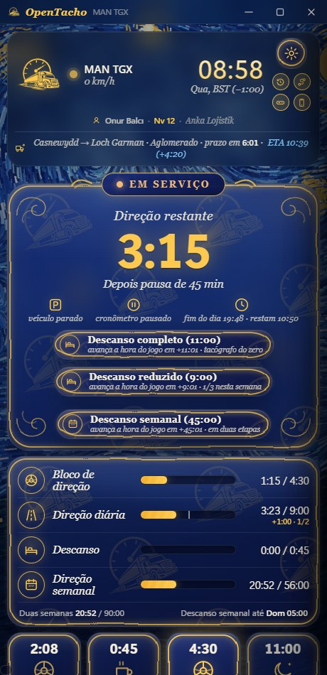
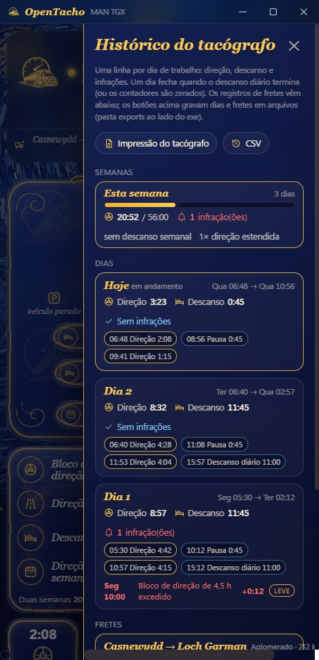
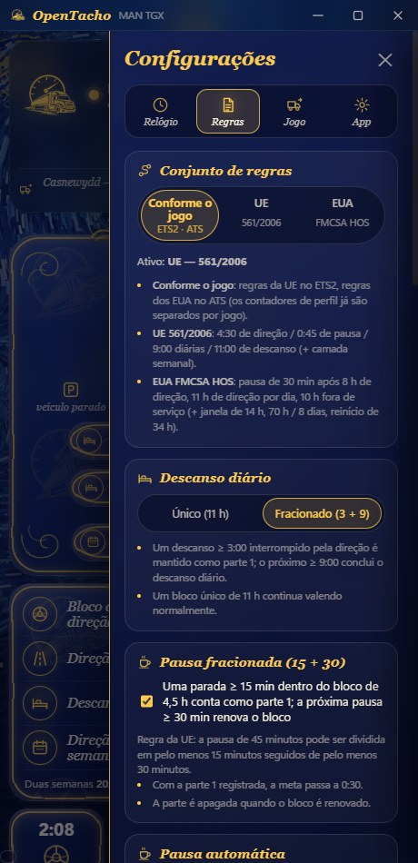
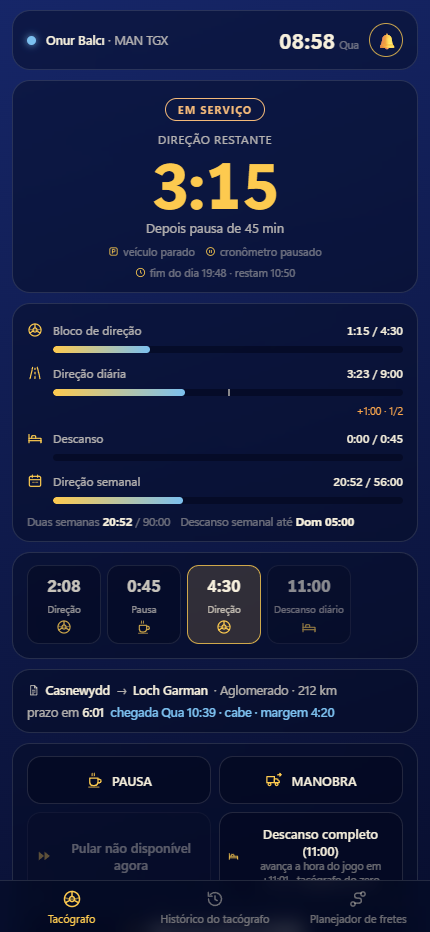

# OpenTacho

[English](README.md) · [Türkçe](README.tr.md) · [Deutsch](README.de.md) · [Русский](README.ru.md) · [Polski](README.pl.md) · **Português (Brasil)** · [Español](README.es.md) · [Français](README.fr.md) · [Italiano](README.it.md) · [Čeština](README.cs.md)

Um tacógrafo de jornada pequeno e sem firulas para **Euro Truck Simulator 2** e
**American Truck Simulator** — uma regra, sem complicação, medida inteiramente em **tempo do jogo**:

> **4:30 de direção → 0:45 de pausa → 4:30 de direção → 11:00 de descanso diário** (ou fracionado em **3:00 + 9:00**)

Ele lê o relógio do jogo, a velocidade, o caminhão e os dados do frete ao vivo, mostra quanto ainda resta
e cuida dos casos chatos (balsas, sono, fusos horários, saves recarregados, carga do reboque) para você só dirigir.

**Somente Windows 10/11** — o plugin de telemetria compartilha dados pela memória compartilhada do Windows e o app usa APIs do Windows para o atalho, os sons e o comando de console. Linux (ETS2 nativo / Proton) e macOS não são suportados.

<p align="center">
  
  
  
</p>
<p align="center">
  
</p>
<p align="center">
  
</p>

## Início rápido

1. Baixe **[OpenTacho-win64.zip](https://github.com/onurbalcii/OpenTacho/releases/latest/download/OpenTacho-win64.zip)**
   (todas as versões: [Releases](https://github.com/onurbalcii/OpenTacho/releases)) e extraia em qualquer lugar.
2. Copie **`plugin\scs-telemetry.dll`** para a pasta de plugins do jogo
   (`…\Euro Truck Simulator 2\bin\win_x64\plugins\` — crie `plugins` se não existir;
   o mesmo para o ATS). Inicie o jogo uma vez e aceite o aviso do SDK.
3. Execute **`OpenTacho.exe`**. É isso — tudo o mais já está na caixa. A primeira execução pede
   seu idioma e mostra um tour guiado curto.

Para o botão ⏩ Pular, ative o console de desenvolvedor no jogo: em
`Documents\Euro Truck Simulator 2\config.cfg` defina `g_console "1"` e `g_developer "1"`.
O botão fica travado até os dois estarem ativos.

Se a janela não abrir de jeito nenhum, instale o
[WebView2 Runtime](https://developer.microsoft.com/microsoft-edge/webview2/) gratuito da Microsoft — ele já faz parte do
Windows 11 e de qualquer Windows 10 atualizado, então isso raramente é necessário.

## Configuração recomendada — importante

Para aproveitar o OpenTacho ao máximo, tire a mecânica de fadiga do próprio jogo do caminho e pule os descansos
pelo app:

1. **Desligue a simulação de fadiga do jogo** — ETS2/ATS: *Opções → Jogabilidade → Simulação de fadiga*
   (desmarque). O relógio de fadiga do jogo não tem relação com a regra da UE: ligado, ele pode obrigá-lo a dormir
   enquanto o tacógrafo ainda mostra tempo de direção — ou deixá-lo seguir quando o tacógrafo manda parar.
2. **Não use o sono do jogo** (áreas de descanso, a ação "dormir" do hotel). São saltos de tempo genéricos que o
   app precisa interpretar: ele os segura por 30 s para distinguir carga de descanso, e o jogo decide quanto
   você dormiu — quase nunca as 11 h que um descanso diário exige, então o descanso fica incompleto.
3. **Pule pausas e descansos pelo app** — quando o tempo de direção acabar, pare o caminhão e pressione
   ⏩ **Pular** (pausa de 45 min / descanso de 11 h) ou **Descanso completo**. O app avança o relógio do jogo exatamente o
   necessário com `g_set_time` e credita nos contadores na hora, ao minuto. Isso exige o
   console do jogo (`config.cfg`: `g_console "1"`, `g_developer "1"`).

Resultado: uma linha do tempo consistente — tempo de direção, pausas, descansos diários e o histórico do tacógrafo
batem com o que você realmente fez.

## Recursos

- **Ao vivo do jogo** – relógio, velocidade, modelo do caminhão, frete ativo (rota, carga, tempo para entregar).
- **Direção / em serviço detectados pela velocidade**; **Pausa** e **Manobra** são botões de um toque.
- **Pausa automática** quando o tempo de direção está quase no fim e o caminhão ficou parado um tempo.
- **Pausa fracionada (15 + 30)**: uma parada ≥ 15 min dentro do bloco de 4,5 h é guardada como parte 1; uma
  pausa posterior ≥ 30 min renova o bloco (regra da UE). Pode ser desligada.
- **Descanso diário fracionado (3 + 9)** com uma faixa de fluxo do dia que mostra cada bloco concluído, o
  atual e o plano; o descanso único de 11 h continua valendo. Pode ser travado em único.
- **Planejador de fretes**: digite a distância e o prazo de entrega da oferta — o app simula pausas e descansos diários/semanais com
  seus saldos atuais e dá tempo total, chegada e margem (**cabe / não cabe**); com um frete aceito, o tempo de rota
  e a janela de entrega vêm do jogo e o resultado aparece ao vivo na linha do frete. A velocidade média é aprendida do odômetro; uma travessia de **balsa/trem**
  na rota é estimada pelo tempo de rota (contada como descanso) e também pode ser informada à mão.
- **Perfil do jogo**: o perfil ativo é reconhecido (nome · nível · empresa no cartão superior); contadores, histórico e eventos são
  mantidos **por perfil** — troque de perfil no jogo e o app troca os contadores (pasta `profiles\`).
- **Modo rigoroso** (opcional): pausas e descansos só contam com o **motor desligado + freio de estacionamento acionado**; o painel principal mostra por que nada está contando.
- **Gravidade das infrações**: cada infração é classificada pelas classes da UE (leve / grave / muito grave); **multas virtuais** opcionais (€, aproximadas); um botão **Pagar** as reflete no jogo — uma cópia do seu save mais recente, com a multa descontada da conta bancária, é gravada em um novo slot chamado "OpenTacho: multa paga", para carregar pelo menu Carregar do jogo.
- **Anúncios por voz**: frases curtas com a voz offline do Windows ("restam 15 minutos de tempo de direção", "pausa concluída"…), em todos os idiomas do app; controles de volume separados para o som de alerta e a voz.
- **Regras semanais** (opcional, Configurações → Regras; modo simples por padrão): direção semanal de **56 h** / quinzenal de **90 h**
  (semana de calendário do jogo), direção diária estendida a **10 h** duas vezes por semana, descanso diário reduzido a **9 h** três
  vezes por semana, **amplitude do dia** (o descanso deve começar em 13/15 h; mostrado como "fim do dia" no painel principal), **descanso semanal**
  45 h / reduzido 24 h (em até 6 dias; um botão o pula em duas etapas), cartões de semana no histórico, novos tipos de infração.
- **Conjunto de regras dos EUA (FMCSA HOS)** para o American Truck Simulator, escolhido automaticamente pelo jogo (Configurações → Regras
  permite forçar UE ou EUA): **pausa de 30 min após 8 h** de direção, **11 h** de direção por dia, **10 h** fora de serviço;
  a camada opcional dos EUA adiciona a **janela de 14 horas** (a direção termina 14 h após a primeira direção do dia, pausas não
  a estendem), o ciclo de **70 h / 8 dias** em serviço e o **reinício de 34 horas** (um botão o pula). Barras, planejador,
  histórico, impressões e textos de voz seguem o conjunto ativo. O fracionamento em cabine leito (7/3) não é modelado.
- **Saltos de tempo tratados**: sono / balsa / trem contam como descanso; **carga e descarga do reboque
  não**; carregar um save volta os contadores para aquele momento.
- **Modo sem frete**: sem entrega ativa → nada conta (o descanso opcionalmente ainda conta). Definir uma
  rota no GPS inicia uma contagem provisória que é revertida se você nunca aceitar o frete.
- **Manobra automática**: liga quando um frete começa e perto da área de entrega, desliga acima de
  40 km/h.
- **Fusos horários locais**: o HUD mostra a hora local do país; o app lê o fuso do
  save mais recente para os dois relógios baterem.
- **⏩ Pular**: envia `g_set_time` ao console do jogo para adiantar uma pausa ou descanso. Com o caminhão
  parado aparece também um botão **Descanso completo**: pula todo o descanso diário de 11 h de uma vez (comece um novo frete com contadores zerados).
- **Histórico do tacógrafo**: uma lista aberta pelo botão sob a engrenagem — totais de direção e descanso por dia,
  segmentos (hora, duração) e infrações (bloco de 4,5 h / 9 h diárias excedidos, com hora e excesso), como uma impressão de tacógrafo real.
  O botão ao lado muda para a barra mini sem abrir as configurações.
- **Registros de fretes e exportação**: cada carga é registrada a partir dos eventos de telemetria — rota, carga, km, contagens de direção / pausa /
  infração, receita e atraso na entrega, multa de cancelamento, multas do jogo. Listados na parte de baixo do painel de histórico;
  os botões **Impressão do tacógrafo** (PDF caprichado + txt, como uma impressão DTCO de 24 h: linha do tempo do dia, segmentos, infrações, fretes) e **CSV** (dias + fretes) gravam tudo
  na pasta `exports` ao lado do exe.
- **Alertas sonoros**: uma notificação curta 15 min antes do fim da direção/descanso, duas vezes em uma
  infração, uma vez quando uma pausa/descanso termina (pode ser silenciado; troque os arquivos `.wav` para mudar).
- **Barra mini**: um atalho global (padrão `Ctrl + Num 0`, alterável) troca a janela por um
  pequeno medidor sempre visível sobre o jogo — ícone de status, tempo restante, próximo passo, mini barras (bloco · diário ·
  descanso · semanal/ciclo), relógio do jogo, indicadores, prazo de entrega com o veredito do planejador e botões Pausa / Manobra /
  Pular / Descanso completo / Descanso semanal — arraste para onde quiser; opacidade e tamanho (70–160 %) são ajustáveis.
- **Temas**: Van Gogh (padrão, um fundo pintado por algoritmo no estilo *Noite Estrelada* com
  painéis de vidro), escuro simples, claro simples e **Personalizado**: sua própria imagem de fundo (JPG/PNG/WebP) mais um
  seletor de cores em canvas para as cores da janela e de destaque (RGB/HEX; a cor do texto é escolhida automaticamente, a barra mini
  segue as mesmas cores).
- **Idiomas**: inglês, turco, alemão, russo, polonês, português do Brasil, espanhol, francês, italiano,
  tcheco — adicionar um é um único arquivo JSON.
- **Segunda tela no celular ou tablet** (Configurações → App → *Usar no celular ou tablet*, ou o botão de telefone sob
  a engrenagem): ligue o compartilhamento na rede local e leia o QR code — um dispositivo no mesmo Wi-Fi mostra o tacógrafo no
  navegador, sem app: status, tempo restante, barras, fluxo do dia, frete com ETA, indicadores, eventos, além das abas de histórico e planejador.
  Pausa / Manobra / Pular / Descanso completo funcionam pelo celular (pode ser desativado); a página mantém a tela acesa
  e toca/vibra nos alertas. O link leva uma chave aleatória, nada é exposto à internet e nada
  fica escutando com o compartilhamento desligado. O Firewall do Windows pergunta uma vez — permita para redes privadas.
- **Verificação de atualização**: ao iniciar, o app consulta o GitHub pela versão mais recente (pode ser desligado) e mostra uma
  faixa com botão de download quando há versão mais nova; Configurações → App mostra a versão, uma verificação manual
  e o link de download.
- **Primeira execução**: um seletor de idioma e depois um tour guiado curto pela tela e pelas abas de configurações
  (reinicie quando quiser em Configurações → App).
- Lembra posição/tamanho da janela, opção sempre visível, registro de eventos, botão de feedback.

## Como ele conta

| Situação | O que acontece |
|---|---|
| Em movimento > 5 km/h | Direção. Paradas menores que ~2 minutos de jogo (semáforos) continuam como direção. |
| Parado | Em serviço – cronômetro de direção pausado, descanso não conta. |
| Botão **Pausa** | O descanso conta; termina automaticamente quando o caminhão anda. |
| **Manobra** | O movimento não conta como direção; o descanso fica pausado, não é descartado. |
| Salto de tempo (sono, balsa, trem) | Contado como descanso. Balsa/trem e o próprio salto do app são creditados na hora; outros saltos esperam até 30 s caso um evento de frete os marque como carga. |
| Salto de tempo na carga/descarga | Ignorado (detectado pela flag de carga / eventos de frete). |
| Parada de 15–44 min interrompida pela direção | Guardada como parte 1 da pausa; uma pausa posterior de 30 min renova o bloco de 4,5 h. |
| Descanso ≥ 3:00 interrompido pela direção | Guardado como parte 1 de um descanso fracionado; 9:00 depois concluem o dia. |
| O tempo do jogo volta | Save recarregado → contadores restaurados do histórico por minuto. |
| Sem frete ativo e sem rota no GPS | Sem frete: nada avança. |
| Regras semanais ligadas | Direção restante = o menor entre os saldos de bloco / diário / semanal / quinzenal; prazos de fim do dia e descanso semanal no painel principal; um descanso ≥ 24 h conta como reduzido, ≥ 45 h como descanso semanal completo. |

Tudo fica em `state.json` / `history.json` ao lado de `OpenTacho.exe`; apague-os para
começar do zero (ou use *Zerar contadores* nas configurações).

## Perguntas frequentes

**Existe um tacógrafo / controle de tempo de direção para Euro Truck Simulator 2 ou American Truck Simulator?**
Sim — é exatamente isso que o OpenTacho é. Ele conta tempo de direção, pausas e descanso diário em tempo
de jogo e lê o jogo ao vivo pelo plugin de telemetria scs-sdk-plugin.

**Qual regra ele segue?**
Dois conjuntos de regras, escolhidos pelo jogo ou à mão (Configurações → Regras): a regra da UE (561/2006) — 4:30 de direção →
pausa de 45 minutos → 4:30 de direção → 11 horas de descanso diário, a pausa fracionada 15 + 30, o descanso diário fracionado 3 + 9 e uma
camada semanal opcional (56/90 h, extensão a 10 h, descanso reduzido de 9 h, amplitude do dia, descanso semanal) — e a regra FMCSA
dos EUA para o American Truck Simulator (8 h / 30 min / 11 h / 10 h, janela de 14 h opcional, 70 h / 8 dias,
reinício de 34 h).

**Precisa de conexão com a internet ou conta?**
Sem conta, e tudo é contado localmente e offline; nada é enviado. As únicas saídas são a
verificação de atualização opcional (lê as informações da versão mais recente no GitHub, pode ser desligada) e o botão de feedback,
que abre um formulário web no navegador. A segunda tela no celular/tablet fica dentro da sua rede local.

**Funciona com mods de mapa, ProMods ou ATS?**
Sim. Ele só lê telemetria (relógio, velocidade, frete), então mods de mapa e de caminhão não importam, e o
American Truck Simulator usa o mesmo plugin — no ATS as regras FMCSA dos EUA (8 h / 30 min / 11 h / 10 h,
janela de 14 h, 70 h / 8 dias) valem automaticamente; Configurações → Regras pode forçar qualquer conjunto.

**O celular não abre a página / o QR code não funciona.**
Os dois dispositivos devem estar na mesma rede local (mesmo roteador ou o hotspot do celular); redes de convidados com
"isolamento de AP" bloqueiam isso. Permita o OpenTacho no Firewall do Windows para redes privadas (ele pergunta no primeiro uso) e,
se o endereço mostrar a rede errada, escolha outra em *Endereço de rede*. *Novo código* invalida os links antigos.

**A barra mini não aparece sobre o jogo.**
O Windows não consegue desenhar nenhuma sobreposição sobre um jogo em *tela cheia exclusiva*. Coloque o modo de exibição
do jogo em *janela* ou *tela cheia sem bordas* (ETS2: Opções → Gráficos → Tela cheia desligada) e a
barra aparece por cima, com o jogo visível através do fundo translúcido.

**Os limites semanais de 56 / 90 h estão incluídos?**
Sim, opcionalmente: Configurações → Regras → *Aplicar as regras semanais*. O modo simples (só 4:30 / 45 / 11) é o padrão; ao ligar
entram a direção semanal e quinzenal, a extensão a 10 h, o descanso reduzido de 9 h, a amplitude do dia e o descanso semanal de 45 h.

**Devo manter a simulação de fadiga do jogo ligada?**
Não. Desligue-a (*Opções → Jogabilidade*) e pule pausas e descansos com os botões ⏩ Pular / Descanso completo do app
em vez de dormir no jogo — veja *Configuração recomendada* acima. O relógio de fadiga do jogo não segue a
regra da UE, e o sono no jogo raramente dura as 11 h que um descanso diário exige.

**Qual a diferença para apps tipo ELD / de jornada?**
É uma alternativa leve e de código aberto (MIT): conjuntos de regras da UE e dos EUA, sem conta, funciona offline,
uma única pasta portátil com um `.exe`, e cuida de balsas, sono, fusos horários e saves
recarregados por você.

## Estrutura de pastas

```
OpenTacho.exe          o app (build de release)          OpenTacho.py   o mesmo app, executado do código-fonte
plugin/                scs-telemetry.dll → copie para a pasta plugins do jogo
app/                   conteúdo da janela: main.html, mini.html, mobile.html, assets/ (logo, fundo, sons)
lang/                  en, tr, de, ru, pl, pt-BR, es, fr, it, cs — um arquivo JSON por idioma
lib/                   SII_Decrypt.dll (recurso de fuso horário)
docs/screenshots/      as imagens usadas nestes READMEs
third_party/           licenças dos componentes incluídos
tools/                 build.bat (PyInstaller), geradores de assets
```

## Executar / compilar a partir do código

```powershell
git clone https://github.com/onurbalcii/OpenTacho.git
cd OpenTacho
pip install -r requirements.txt
python OpenTacho.py
```

`pip install pyinstaller` e `tools\build.bat` produzem `dist\OpenTacho\OpenTacho.exe` e
`dist\OpenTacho-win64.zip` (o pacote de release). Requer Windows 10/11 com WebView2 (já vem
com o Windows).

## Adicionar um idioma

Copie `lang/en.json` para `lang/<código>.json`, traduza os valores (mantenha os `{placeholders}`
e as tags `<b>`/`<code>`), defina `"_name"`. O novo idioma aparece em Configurações → App e no
seletor de idioma da primeira execução automaticamente.

## Componentes de terceiros e licenças

Veja [`third_party/README.md`](third_party/README.md). O OpenTacho é licenciado sob MIT
([LICENSE](LICENSE)). É uma ferramenta feita por fãs e não tem afiliação com a SCS Software.
