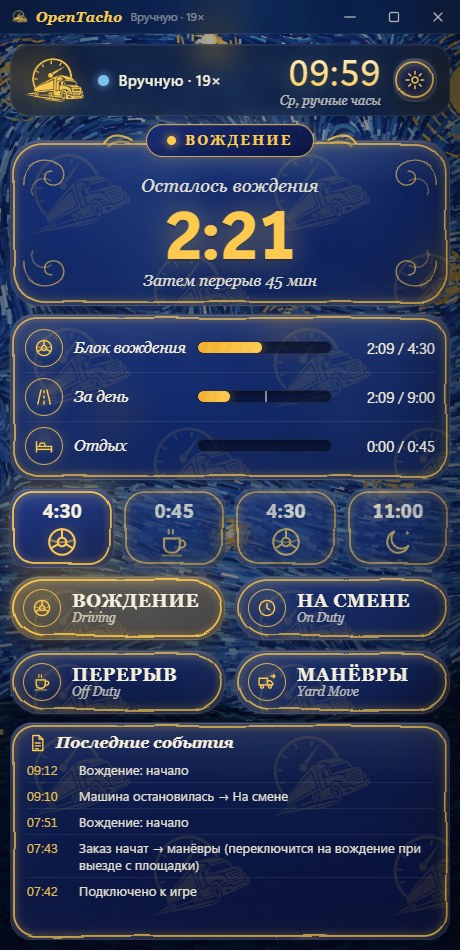
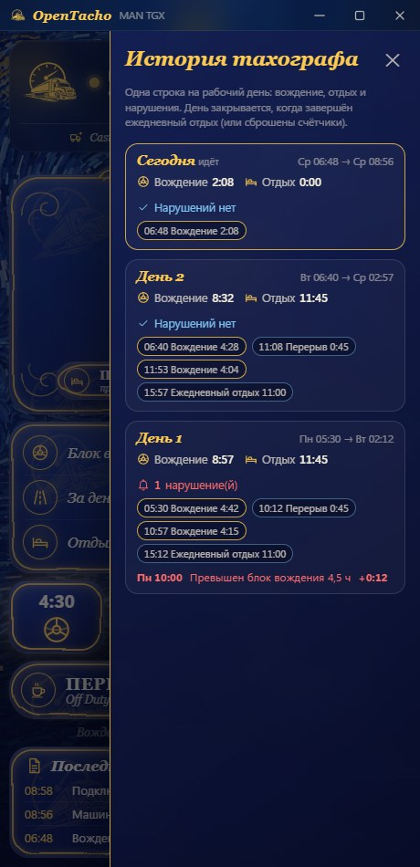
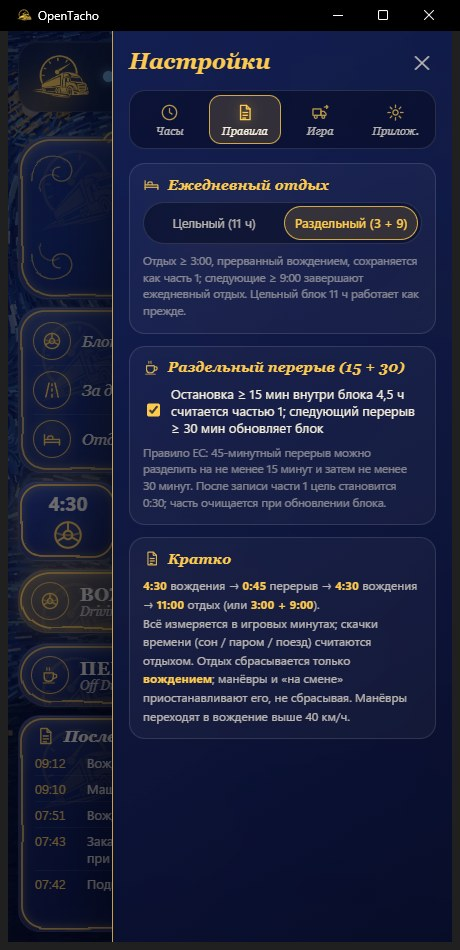

# OpenTacho

[English](README.md) · [Türkçe](README.tr.md) · [Deutsch](README.de.md) · **Русский** · [Polski](README.pl.md)

Небольшой и принципиальный тахограф режима труда и отдыха для **Euro Truck Simulator 2** и
**American Truck Simulator** — одно правило, ничего лишнего, всё измеряется в **игровом времени**:

> **4:30 вождения → 0:45 перерыв → 4:30 вождения → 11:00 ежедневный отдых** (или раздельно **3:00 + 9:00**)

Он читает игровые часы, скорость, данные грузовика и заказа прямо из игры, показывает, сколько
вам осталось, и берёт на себя неудобные случаи (паромы, сон, часовые пояса, загрузка сохранений,
погрузка прицепа), чтобы вы просто ехали.

**Только Windows 10/11** — плагин телеметрии передаёт данные через общую память Windows, а приложение использует Windows API для горячей клавиши, звуков и команды консоли. Linux (нативный ETS2 / Proton) и macOS не поддерживаются.

<p align="center">
  
  
  
</p>
<p align="center">
  
</p>

## Быстрый старт

1. Скачайте **[OpenTacho-win64.zip](https://github.com/onurbalcii/OpenTacho/releases/latest/download/OpenTacho-win64.zip)**
   (все версии: [Releases](https://github.com/onurbalcii/OpenTacho/releases)) и распакуйте куда угодно.
2. Скопируйте **`plugin\scs-telemetry.dll`** в папку плагинов игры
   (`…\Euro Truck Simulator 2\bin\win_x64\plugins\` — создайте `plugins`, если её нет;
   для ATS аналогично). Запустите игру один раз и подтвердите запрос SDK.
3. Запустите **`OpenTacho.exe`**. Всё — больше ничего не нужно. При первом запуске вы выберете
   язык и пройдёте короткое обучение.

Для кнопки ⏩ Пропуск включите консоль разработчика в игре: в
`Documents\Euro Truck Simulator 2\config.cfg` задайте `g_console "1"` и `g_developer "1"`.
Пока оба параметра не включены, кнопка остаётся заблокированной.

Если окно вообще не открывается, установите бесплатный
[WebView2 Runtime](https://developer.microsoft.com/microsoft-edge/webview2/) от Microsoft — он уже входит в
Windows 11 и в любую обновлённую Windows 10, так что это требуется редко.

## Рекомендуемый режим — важно

Чтобы OpenTacho работал в полную силу, выведите из игры её собственную механику усталости и пропускайте
отдых через приложение:

1. **Отключите симуляцию усталости в игре** — ETS2/ATS: *Настройки → Игровой процесс → Симуляция усталости*
   (снимите галочку). Часы усталости игры никак не связаны с правилом ЕС: если оставить их включёнными, игра
   может заставить вас спать, когда тахограф ещё показывает остаток вождения, — или позволить ехать дальше,
   когда тахограф говорит «стоп».
2. **Не используйте игровой сон** (зоны отдыха, действие «спать» в отеле). Это обычные скачки времени, которые
   приложению приходится интерпретировать: оно выдерживает их 30 с, чтобы отличить погрузку от отдыха, а
   длительность сна выбирает игра — часто это не те 11 часов, что нужны ежедневному отдыху, и отдых остаётся
   незавершённым.
3. **Пропускайте перерывы и отдых из приложения** — когда время вождения вышло, остановите грузовик и
   нажмите ⏩ **Пропуск** (перерыв 45 мин / отдых 11 ч) или **Полный отдых**. Приложение промотает игровое
   время ровно на нужную величину командой `g_set_time` и сразу, с точностью до минуты, запишет её в счётчики.
   Для этого нужна консоль игры (`config.cfg`: `g_console "1"`, `g_developer "1"`).

Итог: единая согласованная хронология — вождение, перерывы, ежедневный отдых и история тахографа
точно совпадают с тем, что вы делали на самом деле.

## Возможности

- **Данные из игры в реальном времени** – часы, скорость, модель грузовика, активный заказ (маршрут, груз, время до доставки).
- **Вождение / На смене определяются по скорости**; **Перерыв** и **Манёвры** — кнопки в одно нажатие.
- **Автоматический перерыв**, когда время вождения почти исчерпано, а грузовик какое-то время стоит.
- **Раздельный перерыв (15 + 30)**: остановка ≥ 15 мин внутри блока 4,5 ч сохраняется как часть 1;
  последующий перерыв ≥ 30 мин обновляет блок (правило ЕС). Можно отключить.
- **Раздельный ежедневный отдых (3 + 9)** с лентой хода дня, показывающей каждый завершённый блок,
  текущий и план; цельный отдых 11 ч работает как прежде. Можно зафиксировать цельный режим.
- **Планировщик рейса**: введите расстояние и срок доставки из предложения — приложение смоделирует перерывы и ежедневный/еженедельный
  отдых с вашим текущим запасом и покажет общее время, прибытие и запас (**успеваете / не успеваете**); при взятом заказе время маршрута
  и окно доставки берутся из игры, результат виден в строке заказа. Средняя скорость учится по одометру.
- **Профиль игры**: активный профиль распознаётся (имя · уровень · компания в верхней карточке); счётчики, история и события
  ведутся **для каждого профиля** — при смене профиля в игре приложение переключает счётчики (папка `profiles\`).
- **Строгий режим** (по желанию): перерывы и отдых засчитываются только при **выключенном двигателе + стояночном тормозе**; главная панель показывает, почему ничего не считается.
- **Тяжесть нарушений**: каждое нарушение помечается по классам ЕС (незначительное / серьёзное / очень серьёзное); **виртуальные штрафы** (€, примерно) по желанию на карточках дней и недель.
- **Голосовые объявления**: короткие фразы офлайн-голосом Windows («до конца вождения 15 минут», «перерыв завершён» …), на пяти языках.
- **Недельные правила** (по желанию, Настройки → Правила; по умолчанию простой режим): **56 ч** в неделю / **90 ч** за две
  недели (игровая календарная неделя), дневное вождение дважды в неделю до **10 ч**, ежедневный отдых трижды в неделю до
  **9 ч**, **рабочий день** (отдых должен начаться в пределах 13/15 ч; на главной панели «конец дня»), **еженедельный отдых**
  45 ч / сокращённый 24 ч (не позднее чем через 6 дней; одна кнопка пропускает его в два шага), карточки недель в истории, новые виды нарушений.
- **Скачки времени учтены**: сон / паром / поезд считаются отдыхом; **погрузка и разгрузка
  прицепа — нет**; загрузка сохранения откатывает счётчики к тому моменту.
- **Режим без заказа**: нет активной доставки → ничего не учитывается (отдых — по желанию). Задание
  маршрута GPS запускает предварительный учёт, который отменяется, если заказ так и не взят.
- **Автоматика манёвров**: включается в начале заказа и рядом с зоной доставки, выключается выше 40 км/ч.
- **Местные часовые пояса**: HUD показывает местное время страны; приложение читает пояс из
  новейшего сохранения, чтобы часы совпадали.
- **⏩ Пропуск**: отправляет `g_set_time` в консоль игры, чтобы промотать перерыв или отдых. Когда грузовик стоит,
  появляется и кнопка **Полный отдых**: пропускает весь 11-часовой ежедневный отдых за раз (новый рейс с обнулёнными счётчиками).
- **История тахографа**: список, открываемый кнопкой под шестерёнкой — вождение и отдых по дням,
  отрезки (время, длительность) и нарушения (превышен блок 4,5 ч / 9 ч в день, со временем и величиной превышения), как распечатка настоящего тахографа.
  Кнопка рядом переключает на мини-панель без входа в настройки.
- **Звуковые уведомления**: короткий сигнал за 15 мин до конца вождения/отдыха, дважды при нарушении,
  один раз по завершении перерыва/отдыха (можно отключить; замените `.wav`-файлы, чтобы изменить звук).
- **Мини-панель**: глобальная горячая клавиша (по умолчанию `Ctrl + Num 0`, настраивается) меняет окно на
  небольшой индикатор поверх игры — значок статуса, остаток времени, следующий шаг, три мини-полосы,
  игровые часы, флажки, срок доставки и кнопки Перерыв / Манёвры / Пропуск — перетаскивайте куда угодно.
- **Темы**: Ван Гог (по умолчанию, алгоритмически нарисованный фон в стиле *Звёздной ночи*
  со стеклянными панелями), простая тёмная, простая светлая и **Свой**: собственное фоновое изображение (JPG/PNG/WebP)
  плюс canvas-палитра для цвета окна и акцента (RGB/HEX; цвет текста подбирается сам, мини-панель использует те же цвета).
- **Языки**: русский, английский, турецкий, немецкий, польский — новый язык добавляется одним JSON-файлом.
- **Первый запуск**: выбор языка, затем короткое обучение по экрану и вкладкам настроек
  (в любой момент можно запустить заново: Настройки → Приложение).
- Запоминает положение/размер окна, режим «поверх всех окон», журнал событий, кнопка обратной связи.

## Как ведётся подсчёт

| Ситуация | Что происходит |
|---|---|
| Движение > 5 км/ч | Вождение. Остановки короче ~2 игровых минут (светофоры) остаются вождением. |
| Стоянка | На смене – таймер вождения на паузе, отдых не идёт. |
| Кнопка **Перерыв** | Отдых идёт; заканчивается автоматически, когда грузовик поедет. |
| **Манёвры** | Движение не считается вождением; отдых приостановлен, но не сброшен. |
| Скачок времени (сон, паром, поезд) | Засчитывается как отдых. Паром/поезд и собственный «Пропуск» — сразу; остальные скачки ждут до 30 с на случай, если событие заказа отметит их как погрузку. |
| Скачок времени при погрузке/разгрузке | Игнорируется (определяется по флагу загруженного груза / событиям заказа). |
| Остановка 15–44 мин, прерванная вождением | Сохраняется как часть 1 перерыва; следующий перерыв 30 мин обновляет блок 4,5 ч. |
| Отдых ≥ 3:00, прерванный вождением | Сохраняется как часть 1 раздельного отдыха; ещё 9:00 завершают день. |
| Игровое время идёт назад | Загружено сохранение → счётчики восстановлены из поминутной истории. |
| Недельные правила включены | Остаток вождения = наименьшее из блока / дня / недели / двух недель; конец дня и срок еженедельного отдыха на главной панели; отдых ≥ 24 ч считается сокращённым, ≥ 45 ч — полным еженедельным. |
| Нет активного заказа и маршрута GPS | Без заказа: ничего не идёт. |

Всё хранится в `state.json` / `history.json` рядом с `OpenTacho.exe`; удалите их, чтобы начать
с нуля (или используйте *Сбросить счётчики* в настройках).

## Частые вопросы

**Есть ли тахограф / трекер времени вождения для Euro Truck Simulator 2 или American Truck Simulator?**
Да — это и есть OpenTacho. Он считает время вождения, перерывы и ежедневный отдых в игровом
времени и читает игру в реальном времени через плагин телеметрии scs-sdk-plugin.

**Какое правило он применяет?**
Правило режима труда и отдыха ЕС: 4:30 вождения → перерыв 45 минут → 4:30 вождения → 11 часов
ежедневного отдыха, плюс раздельный перерыв 15 + 30 и раздельный ежедневный отдых 3 + 9. Больше ничего.

**Нужен ли интернет или аккаунт?**
Нет. Всё работает локально и офлайн; ничего не отправляется. Единственное внешнее действие —
необязательная кнопка обратной связи, открывающая веб-форму в браузере.

**Работает ли с модами карт, ProMods или ATS?**
Да. Он читает только телеметрию (часы, скорость, заказ), поэтому моды карт и грузовиков не
имеют значения; American Truck Simulator использует тот же плагин.

**Мини-панель не отображается поверх игры.**
Windows не может рисовать оверлей поверх игры в *эксклюзивном полноэкранном* режиме. Переключите
режим экрана игры на *оконный* или *полноэкранный без рамки* (ETS2: Настройки → Графика → Полный
экран выкл.) — панель появится сверху, а игра будет видна сквозь её полупрозрачный фон.

**Есть ли недельные лимиты 56 / 90 ч?**
Да, по желанию: Настройки → Правила → *Применять недельные правила*. По умолчанию простой режим (только 4:30 / 45 / 11);
при включении добавляются недельное и двухнедельное вождение, продление до 10 ч, сокращение до 9 ч, рабочий день и еженедельный отдых 45 ч.

**Оставлять ли включённой симуляцию усталости в игре?**
Нет. Отключите её (*Настройки → Игровой процесс*) и пропускайте перерывы и отдых кнопками ⏩ Пропуск /
Полный отдых в приложении вместо сна в игре — см. раздел *Рекомендуемый режим* выше. Часы усталости игры не
следуют правилу ЕС, а игровой сон редко длится нужные для ежедневного отдыха 11 часов.

**Чем он отличается от приложений в стиле ELD?**
Это лёгкая альтернатива с открытым исходным кодом (MIT): один набор правил, без аккаунта,
работает офлайн, одна переносимая папка с `.exe`; паромы, сон, часовые пояса и загрузку
сохранений он берёт на себя.

## Структура папки

```
OpenTacho.exe          приложение (сборка релиза)          OpenTacho.py   то же приложение из исходников
plugin/                scs-telemetry.dll → скопировать в папку plugins игры
app/                   содержимое окна: main.html, mini.html, assets/ (логотип, фон, звуки)
lang/                  en, tr, de, ru, pl — по одному JSON-файлу на язык
lib/                   SII_Decrypt.dll (функция часовых поясов)
docs/screenshots/      изображения для этих README
third_party/           лицензии включённых компонентов
tools/                 build.bat (PyInstaller), генераторы ресурсов
```

## Запуск / сборка из исходников

```powershell
git clone https://github.com/onurbalcii/OpenTacho.git
cd OpenTacho
pip install -r requirements.txt
python OpenTacho.py
```

`pip install pyinstaller` и `tools\build.bat` создают `dist\OpenTacho\OpenTacho.exe` и
`dist\OpenTacho-win64.zip` (пакет релиза). Требуется Windows 10/11 с WebView2 (входит в Windows).

## Добавление языка

Скопируйте `lang/en.json` в `lang/<код>.json`, переведите значения (сохраните `{плейсхолдеры}`
и теги `<b>`/`<code>`), укажите `"_name"`. Новый язык автоматически появится в Настройки → Приложение
и в выборе языка при первом запуске.

## Сторонние компоненты и лицензии

См. [`third_party/README.md`](third_party/README.md). OpenTacho распространяется по лицензии MIT
([LICENSE](LICENSE)). Это фанатский инструмент, не связанный с SCS Software.
