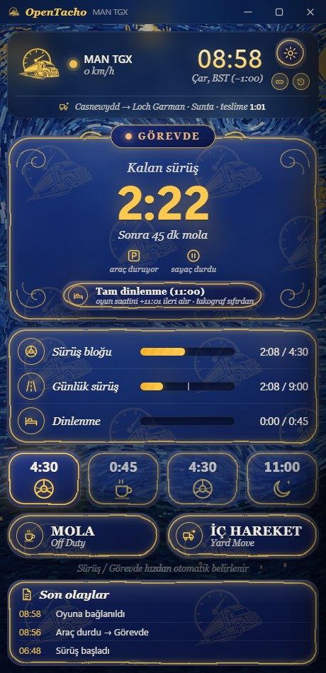
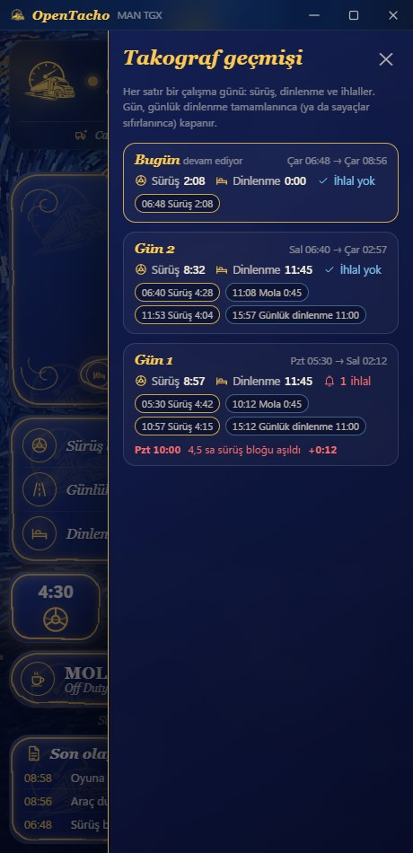
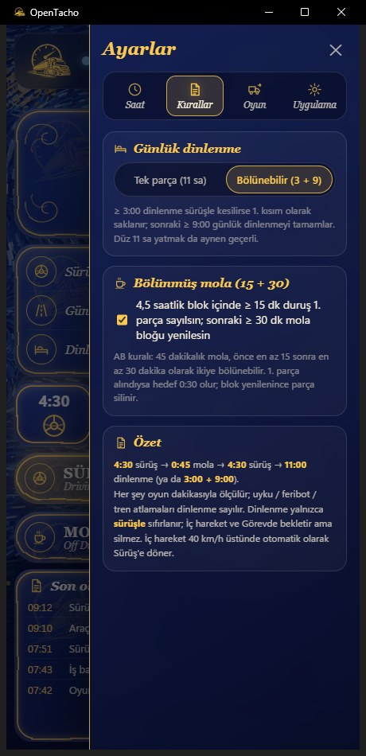

# OpenTacho

[English](README.md) · **Türkçe** · [Deutsch](README.de.md) · [Русский](README.ru.md) · [Polski](README.pl.md)

**Euro Truck Simulator 2** ve **American Truck Simulator** için küçük, tek kurallı bir
çalışma-süresi takografı. Her şey **oyun saatiyle** ölçülür:

> **4:30 sürüş → 0:45 mola → 4:30 sürüş → 11:00 günlük dinlenme** (ya da bölünmüş **3:00 + 9:00**)

Oyun saatini, hızı, kamyonu ve aktif işi oyundan canlı okur; kalan sürenizi gösterir ve zor
durumları (feribot, uyku, saat dilimleri, kayıt geri yükleme, dorse yükleme) sizin yerinize
halleder.

**Yalnızca Windows 10/11** — telemetri eklentisi veriyi Windows paylaşımlı belleğiyle aktarır; kısayol, ses ve konsol komutu da Windows API'leri kullanır. Linux (yerel ETS2 / Proton) ve macOS desteklenmez.

<p align="center">
  
  
  
</p>
<p align="center">
  
</p>

## Hızlı başlangıç

1. **[OpenTacho-win64.zip](https://github.com/onurbalcii/OpenTacho/releases/latest/download/OpenTacho-win64.zip)**
   dosyasını indir (tüm sürümler: [Releases](https://github.com/onurbalcii/OpenTacho/releases)), istediğin yere çıkar.
2. **`plugin\scs-telemetry.dll`** dosyasını oyunun eklenti klasörüne kopyala
   (`…\Euro Truck Simulator 2\bin\win_x64\plugins\` — `plugins` yoksa oluştur; ATS için de aynı).
   Oyunu bir kez başlatıp SDK uyarısını onayla.
3. **`OpenTacho.exe`**'yi çalıştır. Hepsi bu — başka bir şey indirmek gerekmez. İlk açılışta dilini
   seçersin ve kısa bir rehber tur başlar.

⏩ Atla butonu için oyunda geliştirici konsolunu aç: `Documents\Euro Truck Simulator 2\config.cfg`
içinde `g_console "1"` ve `g_developer "1"`. İkisi de açık olmadıkça buton kilitli kalır.

Pencere hiç açılmıyorsa Microsoft'un ücretsiz
[WebView2 Runtime](https://developer.microsoft.com/microsoft-edge/webview2/) paketini kur — Windows 11'de ve
güncel Windows 10'da zaten vardır, bu yüzden nadiren gerekir.

## Önerilen kullanım — önemli

OpenTacho'dan en iyi verimi almak için oyunun kendi yorgunluk mekaniğini devreden çıkar ve dinlenmeleri
uygulama üzerinden atla:

1. **Oyun içi yorgunluk simülasyonunu kapat** — ETS2/ATS: *Seçenekler → Oynanış → Yorgunluk simülasyonu*
   (işareti kaldır). Oyunun yorgunluk saatinin AB kuralıyla ilgisi yok: açık kalırsa takograf daha sürüş hakkın
   var derken oyun seni uyumaya zorlayabilir, ya da takograf dur derken oyun sürdürtebilir.
2. **Oyunun uyku mekaniğini kullanma** (dinlenme alanları, oteldeki "uyu" seçeneği). Bunlar uygulamanın
   yorumlamak zorunda kaldığı genel zaman atlamalarıdır: yükleme mi dinlenme mi diye 30 sn bekler, ne kadar
   uyuduğuna da oyun karar verir — çoğu zaman günlük dinlenmenin istediği 11 saat tutmaz, dinlenme eksik kalır.
3. **Molayı ve dinlenmeyi uygulamadan atla** — sürüş hakkın bitince aracı durdur, ⏩ **Atla** (45 dk mola /
   11 sa dinlenme) ya da **Tam dinlenme** düğmesine bas. Uygulama `g_set_time` ile oyun saatini tam gereken
   kadar ileri alır ve süreyi anında, dakikası dakikasına sayaçlara yazar. Bunun için oyun konsolu açık olmalı
   (`config.cfg`: `g_console "1"`, `g_developer "1"`).

Sonuç: tek ve tutarlı bir zaman çizelgesi — sürüş süresi, molalar, günlük dinlenmeler ve takograf geçmişi
gerçekten yaptığınla birebir örtüşür.

## Özellikler

- **Oyundan canlı** – saat, hız, kamyon modeli, aktif iş (rota, yük, teslime kalan süre).
- **Sürüş / Görevde** hızdan otomatik; **Mola** ve **İç hareket** tek dokunuş.
- **Otomatik mola**: sürüş hakkı azalıp araç bir süre durunca kendiliğinden.
- **Bölünmüş mola (15 + 30)**: 4,5 saatlik blok içinde ≥ 15 dk duruş 1. parça olarak saklanır;
  sonraki ≥ 30 dk mola bloğu yeniler (AB kuralı). Kapatılabilir.
- **Bölünmüş günlük dinlenme (3 + 9)** ve günün gerçek akışını gösteren kutucuk şeridi
  (tamamlanan bloklar ✓, şu anki, plan). Tek parça 11 saat aynen çalışır; tek parçaya kilitlenebilir.
- **Zaman atlamaları**: uyku / feribot / tren dinlenme sayılır; **dorse yükleme/boşaltma sayılmaz**;
  kayıt yüklenince sayaçlar o ana geri döner.
- **Görev dışı modu**: aktif teslimat yoksa hiçbir şey ilerlemez (dinlenme isteğe bağlı sayılır).
  GPS'e rota koyunca geçici sayım başlar; iş alınmazsa geri alınır.
- **İç hareket otomasyonu**: iş başlayınca ve teslimat sahasına yaklaşınca açılır, 40 km/h üstünde kapanır.
- **Yerel saat dilimleri**: HUD ülkenin yerel saatini gösterir; uygulama dilimi en yeni kayıt
  dosyasından okuyup saati eşitler.
- **⏩ Atla**: oyun konsoluna `g_set_time` göndererek molayı/dinlenmeyi ileri sarar. Araç dururken
  **Tam dinlenme** düğmesi de çıkar: 11 saatlik günlük dinlenmeyi tek seferde atlar (yeni yüke sıfır sayaçla başlamak için).
- **Takograf geçmişi**: dişlinin altındaki düğmeyle açılan liste — gün gün sürüş ve dinlenme toplamları,
  segmentler (saat, süre) ve ihlaller (4,5 sa blok / 9 sa günlük aşımı, saat ve aşım süresiyle), gerçek takograf çıktısı gibi.
  Yanındaki düğme ayarlara girmeden mini şeride geçer.
- **Sesli uyarı**: sürüş/dinlenme bitimine 15 dk kala kısa bir bildirim sesi, ihlalde iki kez,
  mola/dinlenme tamamlanınca bir kez (kapatılabilir; `.wav` dosyalarını değiştirerek özelleştirilebilir).
- **Mini şerit**: global kısayol (varsayılan `Ctrl + Num 0`, değiştirilebilir) pencereyi oyunun
  üstünde küçük, sürüklenebilir bir göstergeyle değiştirir — durum ikonu, kalan süre, sonraki adım,
  üç mini çubuk, oyun saati, bayraklar, teslimat süresi ve Mola / İç hareket / Atla düğmeleri.
- **Temalar**: Van Gogh (varsayılan; *Yıldızlı Gece* esintili algoritmik arka plan + cam paneller),
  sade koyu, sade açık ve **Özel**: kendi arka plan görselin (JPG/PNG/WebP) + canvas renk seçiciyle pencere ve
  vurgu rengi (RGB/HEX; yazı rengi kendiliğinden seçilir, mini şerit aynı renkleri kullanır).
- **Diller**: Türkçe, İngilizce, Almanca, Rusça, Lehçe — yeni dil tek JSON dosyası.
- **İlk açılış**: dil seçimi, ardından ekranı ve ayar sekmelerini adım adım anlatan kısa bir rehber turu
  (Ayarlar → Uygulama'dan her zaman yeniden başlatılabilir).
- Pencere konumu/boyutu hatırlanır, her zaman üstte seçeneği, olay listesi, geri bildirim butonu.

## Nasıl sayar

| Durum | Ne olur |
|---|---|
| 5 km/h üstü hareket | Sürüş. ~2 oyun dakikasından kısa duruşlar (trafik ışığı) sürüşten sayılır. |
| Duruyor | Görevde – sürüş sayacı durur, dinlenme işlemez. |
| **Mola** butonu | Dinlenme işler; araç hareket edince kendiliğinden biter. |
| **İç hareket** | Hareket sürüşe sayılmaz; dinlenme bekler, silinmez. |
| Zaman atlaması (uyku, feribot, tren) | Dinlenme sayılır. Feribot/tren ve uygulamanın kendi Atla'sı anında; diğer atlamalar bir iş olayı yükleme olduğunu gösterebilir diye 30 sn'ye kadar bekletilir. |
| Yükleme/boşaltmadaki atlama | Yok sayılır (yük yüklendi bayrağı / iş olaylarıyla tespit). |
| 15–44 dk duruş sürüşle kesilirse | Mola 1. parçası olarak saklanır; sonraki 30 dk mola 4,5 saatlik bloğu yeniler. |
| ≥ 3:00 dinlenme sürüşle kesilirse | Bölünmüş dinlenmenin 1. kısmı olarak saklanır; sonraki 9:00 günü tamamlar. |
| Oyun saati geri giderse | Kayıt yüklendi → sayaçlar dakikalık geçmişten o ana döner. |
| Aktif iş ve GPS rotası yoksa | Görev dışı: hiçbir şey ilerlemez. |

Her şey `OpenTacho.exe`'nin yanındaki `state.json` / `history.json` dosyalarında tutulur; sıfırdan
başlamak için silebilirsin (ya da Ayarlar → *Sayaçları sıfırla*).

## Sık sorulanlar

**Euro Truck Simulator 2 ya da American Truck Simulator için takograf / sürüş süresi takip uygulaması var mı?**
Evet — OpenTacho tam olarak bu. Sürüş süresini, molaları ve günlük dinlenmeyi oyun saatiyle
sayar; oyunu scs-sdk-plugin telemetri eklentisi üzerinden canlı okur.

**Hangi kuralı uygular?**
AB çalışma-süresi kuralı: 4:30 sürüş → 45 dk mola → 4:30 sürüş → 11 saat günlük dinlenme; ek
olarak 15 + 30 bölünmüş mola ve 3 + 9 bölünmüş günlük dinlenme. Başka bir şey yok.

**İnternet ya da hesap gerekiyor mu?**
Hayır. Her şey yerelde ve çevrimdışı çalışır; hiçbir veri gönderilmez. Dışa açılan tek şey,
isteğe bağlı geri bildirim butonunun tarayıcıda açtığı formdur.

**Harita modları, ProMods ya da ATS ile çalışır mı?**
Evet. Yalnızca telemetri (saat, hız, iş) okuduğu için harita ve kamyon modları fark etmez;
American Truck Simulator da aynı eklentiyi kullanır.

**Mini şerit oyunun üstünde görünmüyor.**
Windows, *özel tam ekran* (exclusive fullscreen) modundaki bir oyunun üstüne hiçbir şey çizemez.
Oyunun görüntü modunu *pencereli* ya da *kenarlıksız tam ekran* yap (ETS2: Seçenekler → Grafik →
Tam ekran kapalı); şerit üstte görünür, saydam arka planından oyun seçilir.

**Oyunun yorgunluk simülasyonunu açık mı bırakmalıyım?**
Hayır. Kapat (*Seçenekler → Oynanış*) ve oyunda uyumak yerine molayı/dinlenmeyi uygulamanın ⏩ Atla /
Tam dinlenme düğmeleriyle atla — yukarıdaki *Önerilen kullanım* bölümüne bak. Oyunun yorgunluk saati AB
kuralına uymaz, oyun içi uyku da günlük dinlenmenin istediği 11 saati nadiren tutar.

**ELD tarzı / çalışma-süresi uygulamalarından farkı ne?**
Hafif ve açık kaynak (MIT) bir alternatif: tek kural seti, hesap yok, çevrimdışı çalışır, tek
bir taşınabilir klasörde `.exe`; feribot, uyku, saat dilimi ve kayıt geri yüklemelerini sizin
yerinize halleder.

## Klasör düzeni

```
OpenTacho.exe          uygulama (sürüm paketi)             OpenTacho.py   aynı uygulama, kaynaktan
plugin/                scs-telemetry.dll → oyunun plugins klasörüne kopyalanır
app/                   pencere içeriği: main.html, mini.html, assets/ (logo, arka plan, sesler)
lang/                  tr, en, de, ru, pl — dil başına bir JSON dosyası
lib/                   SII_Decrypt.dll (saat dilimi özelliği)
docs/screenshots/      README'lerde kullanılan görüntüler
third_party/           paketlenen bileşenlerin lisansları
tools/                 build.bat (PyInstaller), görsel/ses üreticiler
```

## Kaynaktan çalıştırma / derleme

```powershell
git clone https://github.com/onurbalcii/OpenTacho.git
cd OpenTacho
pip install -r requirements.txt
python OpenTacho.py
```

`pip install pyinstaller` sonrası `tools\build.bat`, `dist\OpenTacho\OpenTacho.exe` ve
`dist\OpenTacho-win64.zip` (sürüm paketi) üretir. Windows 10/11 ve WebView2 gerekir (Windows ile gelir).

## Yeni dil ekleme

`lang/en.json` dosyasını `lang/<kod>.json` olarak kopyala, değerleri çevir (`{yer_tutucuları}` ve
`<b>`/`<code>` etiketlerini koru), `"_name"` alanını yaz. Yeni dil Ayarlar → Uygulama'da ve ilk açılış
dil ekranında kendiliğinden görünür.

## Üçüncü taraf bileşenler ve lisanslar

Bkz. [`third_party/README.md`](third_party/README.md). OpenTacho MIT lisanslıdır ([LICENSE](LICENSE)).
Hayran yapımı bir araçtır; SCS Software ile bağlantısı yoktur.
